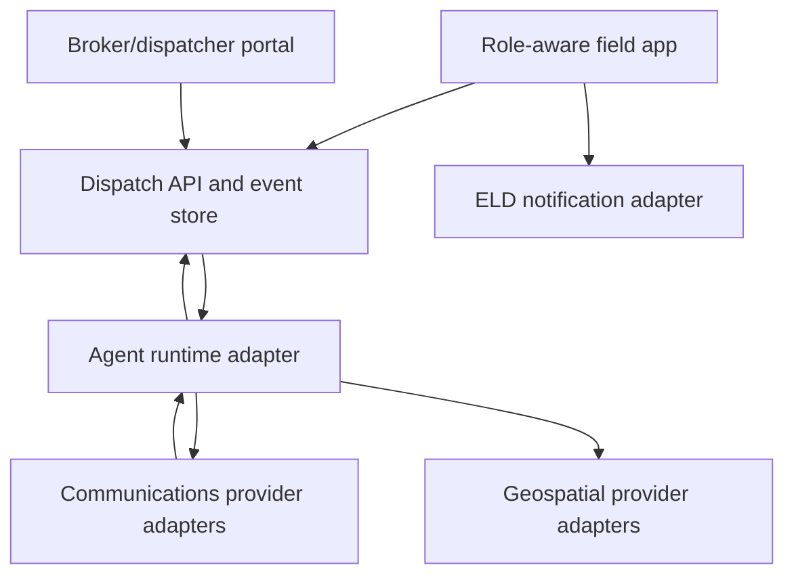
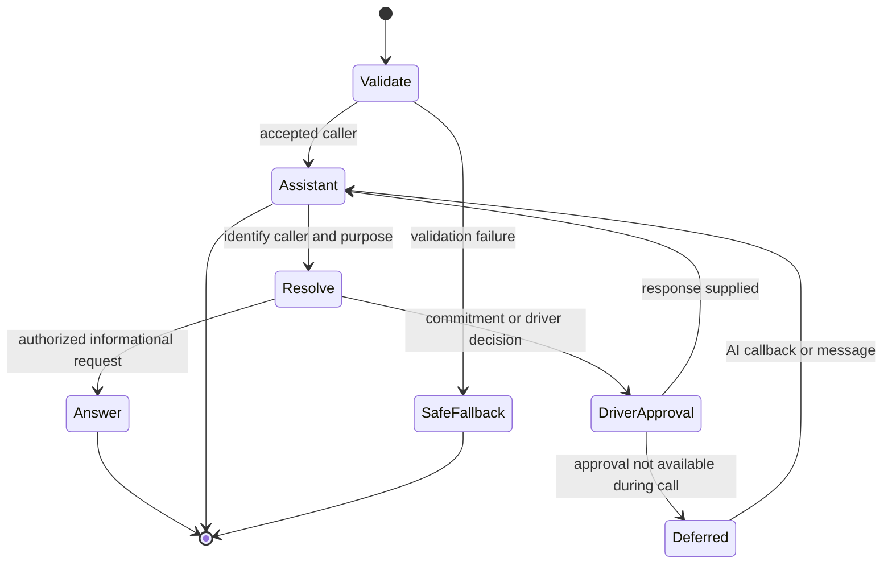

# Driver Dispatch Platform

## Product and Engineering Specification — Version 1.2

**Status:** coding-agent implementation contract  
**Primary users:** operational participants assigned capability-bearing roles; seeded profiles are driver, administrator, dispatcher, shipper, receiver, and broker  
**Core services:** provider-neutral agent runtime (Hermes initially), Android, provider-neutral communications adapters (Twilio initially), and provider-neutral geospatial adapters (Google Maps initially)

## 1. Purpose

Build a role-aware field Android application and an operations web portal that share a current operational view of an assigned participant, trip, load, communications, and location. `DRIVER` is the initial field-role profile, not a hard-coded identity type. A configured agent-runtime adapter provides conversational orchestration; Hermes is the initial implementation. Configured provider adapters own SMS and PSTN transport; Twilio is the initial implementation. Every business call is handled exclusively by the AI assistant. The ELD contributes notifications only and is never treated as a legal or authoritative hours-of-service record.

The system must distinguish four kinds of information:

1. **Driver declarations** — statuses explicitly submitted by the driver.
2. **Observed facts** — GPS samples, delivery timestamps, call events, and message events.
3. **External notices** — ELD and other Android notifications.
4. **AI inferences** — summaries, predicted arrival times, detected conflicts, and suggested actions.

The UI and API must preserve these distinctions. An AI inference must never overwrite a driver declaration or be presented as one.

## 2. Scope

### 2.1 Initial release

- Role-aware Android field application with `DRIVER` as the initial role profile.
- Responsive broker/dispatcher web portal.
- Driver-authored current status and append-only status history.
- Consent-based foreground and trip-scoped background GPS sharing.
- Google Maps display, route planning, navigation handoff, ETA calculation, and route-deviation warnings.
- ELD notification intake through Android `NotificationListenerService`.
- Telegram and WhatsApp integration through supported platform gateways behind communications adapters; Android notifications may supplement but not replace supported APIs.
- Twilio SMS/MMS send and receive.
- Twilio inbound and outbound voice, always entering through the configured AI assistant; Hermes is the initial agent runtime.
- On-device driver face verification for selected consequential actions.
- Driver approval controls for consequential commitments, without live call escalation.
- Auditable event history with source, actor, timestamps, and correlation identifiers.

### 2.2 Explicitly out of scope

- Editing, certifying, or interpreting legal ELD records.
- Continuous facial surveillance, emotion recognition, demographic inference, or identifying unknown people.
- Hidden location collection.
- Accessibility-service automation of WhatsApp, Telegram, or ELD screens.
- Autonomous acceptance of loads, rate agreements, appointment changes, detention agreements, or other binding commitments in the first release.
- Receiving emergency or urgency-labeled calls on the driver’s handset. Inbound callers cannot use urgency language to bypass the AI assistant.

## 3. System topology



### 3.1 Trust boundaries

- Android owns driver consent, driver-entered status, device location acquisition, and local biometric/face-verification UI.
- The backend owns durable operational state, authorization, webhook validation, event ordering, and portal delivery.
- The configured agent runtime proposes or executes only provider-neutral typed tools through policy checks.
- Configured telecom providers own PSTN and SMS transport; Twilio is initial. Provider credentials never ship in Android or browser clients.
- Google Maps keys are restricted by application, package, signing certificate, domain, and API.

## 4. User experiences

### 4.1 Field Android application (`DRIVER` initial profile)

The home screen is optimized for one-handed, low-distraction use and contains:

- Large current-status control.
- Current assignment, next stop, appointment window, route, and ETA.
- Location-sharing state: `off`, `trip only`, or `temporarily shared`.
- Communications inbox combining SMS, voice, Telegram, WhatsApp, and ELD notification summaries while retaining channel and provider provenance.
- AI assistant button supporting text and push-to-talk.
- Pending approvals: proposed SMS, proposed callback, requested status confirmation, load/appointment decision.
- Safety banner suppressing nonessential interaction while driving.

The driver can always correct or supersede a status. Corrections create a new event; they do not rewrite prior history.

### 4.2 Broker/dispatcher page

Canonical route: `/operations/participants/:participantId`. `/operations/drivers/:driverId` is the initial `DRIVER` compatibility projection.

The page contains:

1. **Identity and assignment header** — verified driver identity, tractor/trailer, current load, dispatcher, broker, and freshness indicator.
2. **Current status card** — driver-declared status, declaration time, age, optional note, and verification marker.
3. **Live map** — last location, accuracy radius, sample age, planned route, stops, geofences, ETA, and route deviation.
4. **Trip timeline** — immutable driver statuses, observed arrivals/departures, ELD notices, messages, calls, and AI recommendations.
5. **Communication panel** — SMS, call history, Telegram/WhatsApp references, drafts, transcripts when legally enabled, and callbacks.
6. **AI assistant panel** — natural-language questions, action proposals, evidence references, and approval controls.
7. **Exception panel** — stale location, late-risk prediction, unanswered check-in, route deviation, conflicting status, and ELD notifications. The panel does not assign priority tiers.

Broker access is assignment-scoped. A broker sees only the load, driver contact surface, status, and location fields authorized for that broker and only for the assignment’s active sharing window. Internal notes and unrelated trip history are excluded.

### 4.3 Role-scoped portal surfaces

The same Phoenix/Datastar application renders navigation and actions from the selected role assignment:

| Profile | Primary route | Surface |
| --- | --- | --- |
| `ADMIN` | `/settings` | Organizations, memberships, role assignments, integrations, retention, and audit; no automatic operational-data visibility |
| `DISPATCHER` | `/operations` | Carrier-scoped roster, assignments, loads, exceptions, communications, proposals, and authorized maps |
| `BROKER` | `/loads/:loadId` | Contracted-load timeline, stops, permitted status/ETA summaries, communications, documents, and proposals |
| `SHIPPER` | `/partner/stops/:stopId` | Pickup readiness, appointment window, arrival/ETA summary, instructions, document references, communications, and proposals |
| `RECEIVER` | `/partner/stops/:stopId` | Delivery readiness, appointment window, arrival/ETA summary, instructions, proof references, communications, and proposals |

When a user has multiple active assignments, the UI shows an explicit role/scope switcher. Changing it reloads authorized server-rendered state and opens a new SSE stream; it does not merge client caches. Every mutation includes the selected `role_assignment_id`, and the server rejects assignments not belonging to the authenticated principal.

Shipper and receiver pages never expose the full driver timeline, continuous route trace, unrelated stops, negotiated rate, internal carrier notes, or other parties' communications. Their status and ETA summaries retain source and freshness labels.

### 4.4 Operations overview

Route: `/operations`

- Searchable driver/load roster.
- Status, location freshness, next appointment, ETA variance, unread communication, and exception columns.
- Map/list toggle.
- Filters for dispatcher, broker, status, risk, stale location, and communication state.
- No biometric data or face image appears in this view.

## 5. Driver status model

### 5.1 Canonical driver-declared statuses

| Code | Label | Meaning |
| --- | --- | --- |
| `AVAILABLE` | Available | Ready for dispatch consideration; not a legal HOS assertion. |
| `OFF_DUTY` | Off duty | Driver operationally unavailable. |
| `PRE_TRIP` | Pre-trip | Preparing vehicle/load. |
| `DEADHEAD` | Deadheading | Traveling without the assigned freight. |
| `EN_ROUTE_PICKUP` | En route to pickup | Traveling to shipper. |
| `AT_PICKUP` | At pickup | Driver declares arrival at shipper. |
| `LOADING` | Loading | Freight is being loaded. |
| `EN_ROUTE_DELIVERY` | En route to delivery | Traveling to consignee. |
| `AT_DELIVERY` | At delivery | Driver declares arrival at consignee. |
| `UNLOADING` | Unloading | Freight is being unloaded. |
| `DELAYED` | Delayed | Delay exists; reason and revised estimate requested. |
| `BREAKDOWN` | Breakdown | Vehicle problem; description and safe-location fields requested. |
| `RESTING` | Resting | Driver unavailable while resting; not an ELD duty-status record. |
| `COMPLETE` | Complete | Driver declares operational completion. |
| `EMERGENCY` | Emergency | Driver-originated safety state that opens emergency guidance and public emergency-service controls; it does not make the driver callable. |

### 5.2 Status event

```json
{
  "event_id": "uuid",
  "participant_id": "uuid",
  "role_assignment_id": "uuid",
  "assignment_id": "uuid-or-null",
  "status": "AT_PICKUP",
  "occurred_at": "RFC3339 timestamp",
  "recorded_at": "RFC3339 timestamp",
  "source": "PARTICIPANT",
  "note": "At receiving gate",
  "location_sample_id": "uuid-or-null",
  "verification": "device_authenticated",
  "supersedes_event_id": null
}
```

Only `source=PARTICIPANT` with the `status.declare.self` capability may update the displayed self-declared status. Under the initial `DRIVER` profile, the presentation label is **Driver-reported status**. Geofences and the configured agent runtime can create suggestions such as “arrival likely,” but the suggestion remains separate until confirmed.

## 6. GPS, maps, and routing

### 6.1 Collection policy

- Location sharing is explicit, visible, and revocable.
- Default collection window is the active assignment plus a configurable grace period.
- Android foreground service notification is displayed during background tracking.
- Adaptive sampling: frequent while moving/navigation is active, less frequent while stationary, and stopped outside an authorized window.
- Every sample records latitude, longitude, horizontal accuracy, acquisition time, upload time, provider, mock-location indication when available, and trip identifier.
- Portal location markers always show accuracy and age.

### 6.2 Modular geospatial services

Google Maps Platform is the first provider, not the domain model:

- Google Maps SDK for Android and Maps JavaScript API are initial presentation adapters.
- Google Routes API is the initial routing/matrix/ETA adapter.
- Google Geocoding/Places is the initial address-search adapter.
- Google Navigation SDK is the initial optional navigation adapter; external Google Maps intent remains a fallback.
- All canonical coordinates, stops, geofences, observed tracks, and accepted route geometries are stored in PostGIS using SRID 4326.
- Google Place IDs, route tokens, encoded polylines, and response payloads are provider references and caches only. They MUST NOT be required identifiers on domain resources or public app contracts.
- Route deviation is an alert, never automatic evidence of misconduct.

PostGIS alone does not supply road-network routing, geocoding, tiles, or navigation. The native replacement target is PostGIS plus separately managed road-network data and adapters—for example pgRouting with an OpenStreetMap-derived network, a self-hosted geocoder, and self-hosted/vector tiles. The provider boundary exists so those pieces can be introduced independently.

### 6.3 Location visibility

Location access must be field- and time-scoped:

- Driver: own current and trip history.
- Assigned dispatcher: active trip and operational retention window.
- Assigned broker: active load window and minimum required detail.
- Administrator: access only for support, security, or audited operational need.

## 7. Biometric and face verification

The system distinguishes Android system authentication from application face matching:

- `SYSTEM_BIOMETRIC` uses Android `BiometricPrompt` with a strong biometric or device credential. It is the first-release mechanism and MUST NOT be labeled “face verified,” because the platform result does not reliably prove which biometric modality was used.
- `FACE_1_TO_1` compares a consenting participant against that participant's enrolled on-device template. It is an optional later adapter behind the contract in Section 25.6.

`FACE_1_TO_1` is verification of a claimed identity, never one-to-many identification. The application MUST NOT search a population, identify an unknown person, continuously scan, track faces, create watchlists, or compare one participant against another participant's template.

### 7.1 Permitted purposes and policy

Permitted purpose keys are versioned and allowlisted:

```text
ACCOUNT_RECOVERY
DEVICE_REBIND
CONSEQUENTIAL_ACTION_APPROVAL
SENSITIVE_DOCUMENT_ACCESS
PAYOUT_OR_CONTACT_CHANGE
```

Every request binds one participant, device, role assignment, purpose, action/document hash where applicable, challenge nonce, policy version, and expiry. Face verification proves only that the enrolled participant was present for that challenge. It does not grant a role, approve an action by itself, prove legal identity beyond the enrollment process, or authorize data outside the surrounding Ash policy.

Face verification is prohibited for attendance surveillance, productivity scoring, continuous driving observation, emotion or impairment inference, demographic or health inference, discipline, employment ranking, or emergency/priority classification. A failed or unavailable face check MUST NOT change driver status, load state, queue priority, compensation, or employment standing.

### 7.2 Consent and enrollment

Enrollment requires all of the following:

1. An authenticated participant and registered device.
2. A jurisdiction/policy check that permits the feature.
3. Plain-language, purpose-specific consent showing collection, processing location, retention, deletion, fallback, and complaint/contact information.
4. Explicit acceptance of the current consent-text version; consent is not bundled with general terms.
5. Supervised identity proofing or an approved account-recovery process.
6. Successful presentation-attack detection and adequate capture quality.
7. Creation of a hardware-bound device key and encrypted local template.

Enrollment capture is processed in volatile memory. Raw images/video are not uploaded, written to logs, included in crash reports, placed in Android backups, or retained after template creation. The default architecture stores the reusable face template only in app-private device storage encrypted by a non-exportable Android Keystore key, preferring StrongBox/TEE when available. Server-side template storage is prohibited in the initial implementation.

The server stores only enrollment metadata: participant, device, provider/model version, consent record, creation time, invalidation state/reason, and a random enrollment identifier. It never stores embeddings, landmarks, face crops, raw quality vectors, or material from which a face can be reconstructed.

Enrollment is invalidated on consent withdrawal, participant request, account closure, device loss/revocation, app-data removal, Keystore invalidation, device-integrity failure, provider/model incompatibility, or security incident. A device change never copies the template; the participant must re-enroll after approved identity recovery. Android backup/restore MUST exclude templates, enrollment secrets, challenges, and attestations.

### 7.3 Verification challenge and attestation

For online consequential uses, the central service issues a single-use challenge containing a CSPRNG nonce of at least 128 bits, participant ID, device ID, role-assignment ID, purpose, subject/action hash, issued time, expiry no later than two minutes, and policy version. The complete canonical challenge is signed or MAC-bound by the service. The app rejects a challenge with the wrong participant, device, purpose, hash, clock window, signature, or prior-use marker.

The verifier performs capture quality checks, presentation-attack detection, and one-to-one comparison locally. Raw frames, template, landmarks, liveness signals, and similarity score remain inside the verifier process and are destroyed as soon as the decision completes. The result is signed by the registered device key and returned as a minimal attestation:

```text
challenge_id
enrollment_id
participant_id
device_id
purpose
subject_hash
result
provider_id
model_version
policy_version
verified_at
expires_at
device_integrity_class
attestation_signature
```

The server verifies the device signature, challenge binding, enrollment state, consent state, device state, policy/model allowlist, integrity class, time bounds, and single-use constraint in one transaction. An attestation cannot be reused for another action, document, purpose, device, or role assignment. The API and audit log store no similarity score or liveness telemetry.

### 7.4 Result taxonomy and retry behavior

Canonical results are:

| Result | Meaning and required behavior |
| --- | --- |
| `VERIFIED` | Match, liveness, quality, consent, device integrity, and challenge validation passed. Continue through ordinary authorization. |
| `NOT_MATCHED` | Comparison did not meet the versioned threshold. Do not reveal score or threshold; offer a limited retry or fallback. |
| `LIVENESS_FAILED` | Presentation-attack detection failed or was inconclusive in a security-relevant way. End the attempt and apply cooldown. |
| `QUALITY_INSUFFICIENT` | Lighting, framing, focus, occlusion, motion, or camera quality is inadequate. Provide actionable local guidance; this is not a mismatch. |
| `MULTIPLE_FACES` | More than one face is present. Do not choose a face; require a clean retry. |
| `USER_CANCELLED` | User cancelled or app lost foreground. No approval or adverse inference. |
| `LOCKED_OUT` | Retry/cooldown limit reached. Use fallback or wait until the stated time. |
| `CONSENT_REQUIRED` | Consent is absent, expired, withdrawn, or for another purpose/version. |
| `ENROLLMENT_REQUIRED` | No valid enrollment exists for this participant and device. |
| `DEVICE_UNTRUSTED` | Device integrity, key attestation, camera pipeline, or app integrity is unacceptable. |
| `SENSOR_UNAVAILABLE` | Camera/sensor is unavailable, occupied, damaged, or policy-incompatible. |
| `CHALLENGE_INVALID` | Challenge is expired, replayed, malformed, misbound, or has an invalid service signature. |
| `PROVIDER_ERROR` | Verifier failed without a reliable decision. No approval; allow fallback. |
| `REVIEW_REQUIRED` | Policy deliberately routes the user to the non-face review path without asserting match or mismatch. |

At most three quality retries are allowed per challenge. A quality failure does not count as a biometric mismatch. At most two `NOT_MATCHED` decisions are allowed in ten minutes per participant/device/purpose, followed by a 15-minute cooldown or fallback. `LIVENESS_FAILED` ends the challenge and applies the same cooldown. Limits are enforced centrally when online and mirrored locally to prevent UI loops; the stricter effective limit wins. Error messages MUST NOT reveal thresholds, model internals, or whether another person's face was closer.

### 7.5 Edge-case behavior

- Glasses, facial hair, hairstyle, normal aging, and moderate appearance changes are handled by quality guidance and normal matching; repeated non-match routes to fallback/re-enrollment, never silent threshold lowering.
- Masks, face coverings, religious coverings, helmets, glare, darkness, backlighting, camera dirt, motion blur, and partial occlusion produce `QUALITY_INSUFFICIENT` unless the approved model is explicitly validated for that condition.
- Identical twins, close relatives, and lookalikes are known false-match risks. High-consequence purposes require system biometric/device possession plus face verification or fallback review; face alone is insufficient.
- Photos, screens, prerecorded video, video injection, deepfakes, 3D masks, camera-hook frameworks, emulators, rooted devices, debugger/instrumentation, and accessibility-overlay attacks are threat cases. Detection failure returns `LIVENESS_FAILED` or `DEVICE_UNTRUSTED`, never a lower-confidence success.
- More than one visible face returns `MULTIPLE_FACES`; the app never crops/selects one automatically.
- A person unable to position their face, perform an active liveness gesture, use the camera, or satisfy the model because of disability, injury, skin condition, cultural/religious practice, or device limitation receives the equivalent non-face fallback without penalty.
- Randomized active liveness instructions must be accessible, translated, read aloud when requested, and never require actions unsafe or impossible while driving.
- Verification cannot start while driving mode is active. If driving mode activates, the app immediately cancels capture, discards frames, and returns `USER_CANCELLED` with a safety explanation.
- Backgrounding, rotation, process death, incoming calls, camera preemption, permission removal, or screen lock cancels the active capture. The challenge is not marked successful and sensitive memory is cleared.
- Screen capture and non-secure display are blocked during capture where Android permits. This is defense in depth and not treated as liveness proof.
- Offline verification cannot authorize a consequential server mutation. It may create a local pending attempt, but execution waits for a fresh or still-valid server challenge and accepted attestation. Device clock alone never establishes validity.
- Concurrent challenges for the same participant/device/purpose are serialized. Starting a newer challenge cancels the older one; the server accepts at most one attestation.
- Provider/model updates cannot silently reuse an incompatible template or threshold. A signed compatibility manifest either preserves enrollment or requires re-enrollment. Thresholds and liveness policy are versioned, tested, and remotely selectable only from signed allowlisted configuration.

### 7.6 Fallback, privacy, and deletion

Every face-gated purpose has a documented non-face path, such as strong Android biometric/device credential plus support review, supervised document review, or in-person verification. Fallback aims for equivalent outcome, has no lower queue priority, and does not disclose biometric failure to brokers, dispatchers, shippers, receivers, or agent runtimes.

The participant can view enrollment devices, consent version, verification history, purpose, result category, and expiry; revoke consent; invalidate an enrollment; and request deletion. Revocation immediately blocks new challenges and invalidates unconsumed attestations. Local deletion is confirmed by the app with a signed deletion receipt; if the device is lost, server invalidation prevents future acceptance even if local deletion cannot be confirmed.

Attestations are retained only for the configured audit/legal period and then deleted by the audited retention worker. Consent and deletion receipts may be retained as legally required without retaining biometric material. No face data, template, score, liveness telemetry, or raw capture is exposed to agent runtimes, communications providers, maps providers, brokers, dispatchers, shippers, receivers, administrators, developers, analytics, ordinary logs, or crash reporting. Authorized application consumers receive only the canonical result, purpose, policy version, and freshness.

### 7.7 Provider/model release and drift gate

Each provider/model/version/device-class combination requires a signed approval record before the policy manifest can enable it. The record includes license and data-flow review, supported Android/API/camera classes, template compatibility, threshold identifier, liveness configuration, intended purposes, measured false-accept and false-nonmatch rates, presentation-attack results, quality-failure rate, latency, battery/memory bounds, accessibility findings, and known limitations.

Evaluation uses lawfully sourced, consented, independently governed data representative of the intended population and capture conditions. It reports aggregate and worst-observed performance across documented relevant cohorts and intersectional cohorts without inferring those traits in production. One global threshold is used for a purpose/device class unless a reviewed legal and scientific justification permits otherwise; the system never silently gives different users weaker security thresholds.

The product/security/privacy owners must approve numeric acceptance limits for each purpose before enablement. Missing limits, inadequate sample sizes, material cohort disparity, untested device classes, failed presentation-attack cases, or unavailable fallback block release. The coding agent MUST implement the gate but MUST NOT invent acceptance numbers.

Post-release monitoring uses only privacy-preserving canonical outcome aggregates. Model/manifest updates use staged rollout, signed version pinning, rollback, and compatibility checks. A material rise in false nonmatches, liveness failures, provider errors, or support fallbacks automatically disables new face challenges for the affected model/device class and routes users to fallback; it never lowers thresholds automatically.

## 8. Provider-neutral calling and messaging

### 8.1 Universal AI-first call rule

All calls to the published dispatch number enter this state machine:



The configured communications provider invokes an authenticated ingress adapter. That adapter connects the call to the configured agent-runtime session without exposing communications-provider or agent-provider primitives to the domain. Twilio is the initial communications adapter and uses signed HTTPS webhooks, TwiML, and ConversationRelay. The assistant announces that it is an AI assistant at the start of the call. The call is never transferred or conferenced to a human.

The driver’s own outbound call to a public emergency-service number bypasses the agent runtime and uses the device’s normal emergency calling path. This exception applies only to calls initiated by the driver to public emergency services. It never permits an inbound caller to reach the driver.

### 8.2 Inbound no-contact invariant

- No inbound call ever rings, bridges, transfers, or conferences to the driver’s handset.
- Caller-selected labels such as `urgent`, `emergency`, `safety`, or `immediate` grant no additional routing privilege or queue priority.
- A caller reporting an immediate threat to life, safety, cargo, or the public is instructed by the assistant to contact the appropriate public emergency service. The assistant may collect factual details and create a normal asynchronous app event, but it does not call or connect the driver.
- All operational calls, messages, notifications, and approval requests use one priority class. Processing order is deterministic—normally receipt order—rather than based on caller language, AI classification, contact identity, or event type.
- The driver app may group and filter events for comprehension, but those presentation choices do not create routing priority.
- The driver controls notification presentation in the app, including driving-mode suppression; an asynchronous alert is not an inbound phone call.

### 8.3 Assistant authority

The assistant may autonomously:

- Identify the business and itself as an AI assistant.
- Authenticate the caller using configured factors.
- State driver-declared status with timestamp and provenance.
- State last-shared location and ETA with timestamp, accuracy/freshness, and an “estimated” label.
- Take a message, collect reference/load numbers, schedule a callback, and send a factual acknowledgement.
- Take a request that exceeds its authority, issue a reference number, request asynchronous driver approval, and arrange an AI-handled callback or message.

The assistant must obtain asynchronous in-app driver approval before:

- Accepting or rejecting a load.
- Agreeing to or changing a rate, fee, appointment, route obligation, detention term, or delivery commitment.
- Sharing precise location outside the caller’s assignment scope.
- Representing an AI-derived ETA as a guarantee.

### 8.4 Outbound calls

Outbound calls use a structured `CallPlan` containing recipient identity, purpose, permitted disclosures, prohibited commitments, asynchronous approval rules, expiration, and approval. The assistant repeats its AI identity and calls only within consent and calling-hour policy.

### 8.5 SMS

- Inbound messages are received through an authenticated provider adapter and attached to a verified contact/thread. The initial Twilio adapter validates Twilio signatures.
- Outbound content is classified as factual acknowledgement, operational update, or proposed commitment. These classifications control authority and approval, not priority.
- Low-risk acknowledgements may be policy-authorized; commitments require approval.
- STOP/HELP and messaging-consent obligations are handled outside the language model by deterministic code.
- Provider message/call IDs are adapter idempotency inputs and provider references. Canonical application event IDs remain provider-neutral.

### 8.6 Failure behavior

If the configured agent runtime is unavailable, communications ingress must remain operational and provide the provider-supported deterministic fallback: identify the service, take a message where supported, offer an AI-handled callback, and never invent status. Events are durably queued for later processing.

## 9. Agent tools and policy boundary

Any agent-runtime adapter may expose only these provider-neutral typed tools to its runtime, never direct database access or unrestricted provider credentials:

```text
get_participant_status(participant_id, role_assignment_id)
get_active_assignment(participant_id, role_assignment_id)
get_location_summary(participant_id, role_assignment_id, requester_scope)
get_route_eta(assignment_id)
list_recent_eld_notices(participant_id, role_assignment_id)
draft_message(thread_id, purpose, content)
request_driver_approval(action)
send_message(approved_action_id)
prepare_call(contact_id, purpose)
start_call(approved_call_plan_id)
schedule_ai_callback(call_id, condition, expiry)
record_call_disposition(call_id, disposition)
```

Every mutating tool verifies actor, tenant, assignment, recipient, authority, approval, expiry, and idempotency before execution. Prompt text, model configuration, or runtime selection cannot grant authority. Ash validates every tool request independently, so replacing Hermes cannot change authorization semantics.

## 10. Data model

Minimum entities:

- `User`, `Organization`, `Participant`, `RoleDefinition`, `RoleAssignment`, `Device`
- `BrokerContact`, `DispatcherContact`, `ConsentGrant`
- `Vehicle`, `Trailer`, `Load`, `Assignment`, `Stop`
- `ParticipantStatusEvent`, `LocationSample`, `GeofenceEvent`
- `StopReadinessEvent`, `DocumentReference`, `LoadParty`, `StopParty`
- `ExternalNotification` with source package and redacted payload
- `Conversation`, `Message`, `Call`, `CallPlan`, `CallTranscript`
- `ActionProposal`, `Approval`, `ExecutionReceipt`
- `BiometricConsent`, `FaceEnrollment`, `FaceVerificationChallenge`, `FaceVerificationAttestation`, and `BiometricDeletionReceipt`, none containing server-side biometric material
- `AuditEvent`

Every operational record includes tenant, source, creator/actor, created time, effective time, correlation ID, and retention class.

## 11. API surface

Illustrative endpoints:

```text
POST /v1/driver/status-events
POST /v1/driver/location-samples:batch
POST /v1/device/notifications
GET  /v1/operations/drivers
GET  /v1/operations/drivers/{id}
GET  /v1/operations/participants
GET  /v1/operations/participants/{id}
GET  /v1/assignments/{id}/timeline
POST /v1/actions/{id}/approve
POST /v1/actions/{id}/reject
POST /providers/twilio/messages/inbound
POST /providers/twilio/messages/status
POST /providers/twilio/voice/inbound
POST /providers/twilio/voice/status
WS   /providers/twilio/conversation-relay
WS   /v1/operations/events
```

Provider ingress endpoints validate the provider-specific signature before parsing or persisting content. Client-facing APIs use short-lived tokens and role/assignment-scoped authorization.

## 12. Audit and provenance

The append-only audit stream records:

- Driver status declarations and supersessions.
- Location-sharing consent changes.
- Broker/dispatcher views of precise location.
- AI inputs referenced for consequential responses.
- Proposed action, policy result, approval, execution, provider receipt, and failure.
- Call routing, identity/disclosure step, deferred-action handling, callback, and disposition.
- Biometric consent grant/withdrawal, enrollment/invalidation/deletion receipt, challenge lifecycle, verification result, policy/model version, purpose, and fallback selection—never raw face data, template, score, or liveness telemetry.

The system presents a human-readable timeline, but the underlying events retain immutable identifiers and original timestamps. Corrections are compensating/superseding events.

## 13. Security and privacy requirements

- Encrypt data in transit and at rest; use platform keystores for device keys.
- Keep communications-provider, agent-runtime/model-provider, and server geospatial-provider credentials off clients.
- Restrict browser and Android Google Maps keys independently.
- Separate organizations and assignments at the database authorization layer.
- Redact notification secrets and message content from ordinary application logs.
- Apply configurable retention to location, transcripts, recordings, notifications, and biometric attestations.
- Recording is disabled by default. If enabled, determine applicable consent, announce recording, record consent, and provide deletion/access handling.
- Provide driver-accessible history of location sharing, status events, consequential approvals, and face verifications.
- Provide remote session revocation and lost-device handling.

## 14. Reliability and performance

- Durable webhook ingress acknowledges the configured provider promptly and queues downstream work.
- Webhook and tool execution is idempotent.
- Android stores unsent status/location events locally and syncs with monotonic per-device sequence numbers.
- The portal marks stale status and location rather than silently displaying old data as current.
- AI failure never blocks deterministic message-taking or a driver-originated call to public emergency services. There is no inbound route to the driver and no human transfer path.
- Target: new status visible in portal within 5 seconds online; new location within configured sampling plus 10 seconds; inbound call greeting begins within 2 seconds after the voice provider connects.

## 15. Acceptance criteria

1. A driver status change produces an immutable event and updates the portal with source and freshness.
2. A geofence can suggest `AT_PICKUP`, but cannot set it without driver confirmation.
3. A broker with active role and load-party relationships can view authorized status/location summaries; an unrelated broker receives no data.
4. Revoking trip location consent stops collection and portal updates except for queued samples collected before revocation.
5. Every inbound call is handled exclusively by the disclosed AI assistant, with no transfer, conference, or driver-ring path. Declaring an emergency or urgency does not change routing. Requests outside the assistant’s authority produce a reference number and an AI-handled callback or message workflow.
6. Calls, messages, ELD notices, location exceptions, and approval requests share one priority class; no caller label or AI inference can promote an item.
7. The assistant cannot execute a binding commitment without a valid approval matching the action hash and unexpired policy context.
8. Provider webhook forgery, replay, and duplicate-delivery tests fail closed or resolve idempotently; the initial Twilio adapter has signed fixtures.
9. Agent-runtime unavailability produces the deterministic safe fallback.
10. ELD notices are labeled notification-derived and never presented as certified HOS data.
11. Face verification exposes no image or biometric template to any agent runtime, broker, or dispatcher and supports a documented fallback.
12. Stale GPS, weak accuracy, and predicted ETA are visibly labeled.
13. Driver-originated calls to public emergency services bypass the AI assistant; inbound callers can never invoke an emergency bypass to reach the driver.
14. An administrator can manage memberships and role assignments but cannot view precise location, message content, or negotiated load data without a separate scoped operational role.
15. A dispatcher sees only carrier-related participants and loads; removing the assignment relationship terminates REST, page, and SSE access.
16. A shipper can update pickup readiness and propose pickup-window or instruction changes only for its active pickup-stop relationship.
17. A receiver can update delivery readiness and propose delivery-window or instruction changes only for its active delivery-stop relationship.
18. Shipper, receiver, and broker proposals never become confirmed commitments without the same approval and execution-receipt controls used for every consequential action.
19. A production developer with requester eligibility but no approved break-glass request receives no tenant data and no additional application capability.
20. An approved break-glass session is limited to its exact tenant, subjects, capability list, environment, and expiry; revocation or expiry terminates access and active streams immediately.
21. Break-glass activation does not create a standing role, priority tier, human call escalation, database console, secret-access path, or authority to approve or execute a business commitment.
22. System-biometric success is never represented as face verification; optional face verification is one-to-one, consented, purpose-bound, device-bound, challenge-bound, and processed on device.
23. Raw face media, embeddings, landmarks, scores, and liveness telemetry never reach the backend, logs, analytics, crash reports, agent runtime, communications providers, portal users, or backups.
24. Face mismatch, quality failure, liveness failure, disability, unavailable hardware, or consent refusal provides a non-face fallback and never changes status, priority, compensation, role, or employment standing.
25. Consent withdrawal, device revocation, enrollment invalidation, challenge replay, model incompatibility, expiry, and wrong action/purpose binding fail closed before a face attestation can satisfy an authorization check.

## 16. Delivery plan

### Phase 1 — operational core

- Participant identity, seeded role profiles, organizations, party relationships, assignments, status events, capability-driven Android UI, role-scoped portal surfaces, and audit stream.

### Phase 2 — location and routing

- Consent lifecycle, foreground/background GPS, Maps rendering, Routes API, ETA, geofences, deviation alerts.

### Phase 3 — communications

- Provider-neutral SMS and AI-only voice ports, initial Twilio adapters, call/message timelines, and supported Telegram/WhatsApp connectors.

### Phase 4 — controlled automation

- Provider-neutral agent tools, approval receipts, low-risk autonomous acknowledgements, exception triage, and deferred AI callbacks; Hermes is the initial runtime adapter.

### Phase 5 — identity assurance

- Android system biometric authentication first. Optional consented one-to-one on-device face verification ships only after provider/model, presentation-attack, accessibility, demographic performance, consent, jurisdiction, retention, and incident-response gates pass.

## 17. Decisions required before implementation

- Android application package/name and supported minimum Android version.
- ELD application package name and representative notification samples.
- Whether the initial Hermes runtime runs on the Android device, a private server, or both; this does not alter the adapter contract.
- Broker access model: invited accounts, magic links, or organization federation.
- Exact driver status vocabulary and which transitions require notes or verification.
- Location retention and broker visibility windows.
- Jurisdictions of operation for biometric, call-recording, SMS, and employment/privacy requirements.
- Whether `FACE_1_TO_1` will be enabled at all; if yes, the approved on-device provider/model/license, purpose-specific numeric false-accept/false-nonmatch and presentation-attack limits, validated device classes, cohort evaluation report, consent text, fallback owner/SLA, and attestation retention period.
- After-hours AI response, callback, and expiry policy.
- Whether AI calls are limited to intake/relay or may eventually negotiate within explicit numeric and contractual bounds.

## 18. Reference implementation surfaces

- Google Maps Navigation SDK supports embedded Android navigation and route customization: <https://developers.google.com/maps/documentation/navigation/android-sdk>
- Google Routes API provides route and route-matrix computation: <https://developers.google.com/maps/documentation/routes>
- Twilio TwiML controls inbound voice routing: <https://www.twilio.com/docs/voice/twiml>
- Twilio ConversationRelay provides the real-time AI voice connection: <https://www.twilio.com/docs/voice/conversationrelay>
- Ash Framework resources, actions, actors, policies, multitenancy, and ecosystem packages: <https://ash.hexdocs.pm/readme.html>
- AshPostgres is the PostgreSQL data layer for Ash: <https://ash-postgres.hexdocs.pm/readme.html>

## 19. Normative implementation decisions

The words **MUST**, **MUST NOT**, **SHOULD**, and **MAY** are normative. A coding agent must not replace a MUST with a different design without recording an Architecture Decision Record (ADR) and obtaining approval.

### 19.1 Fixed stack

| Component | Required implementation |
| --- | --- |
| Android | Kotlin, Jetpack Compose, coroutines/Flow, Room, WorkManager, Hilt, Retrofit/OkHttp, Kotlin serialization |
| Android minimum | `minSdk 29`; target the current stable Android SDK at implementation time |
| Central service | Elixir/OTP, Phoenix, Ash Framework, AshPostgres, Ecto/Postgrex, AshAuthentication, AshPhoenix, AshOban, AshStateMachine, AshCloak |
| Android/API contract | OpenAPI 3.1 is canonical at the transport boundary; Android Kotlin DTO/client code is generated into an Android-only module |
| Agent runtime | Provider-neutral supervised Elixir port with Hermes as the initial adapter; no runtime accesses Ash data layers directly |
| Portal | Phoenix-rendered HEEx/function components with Datastar; self-hosted, version-pinned Datastar bundle; provider-neutral map custom element with Google as the initial adapter |
| Database | PostgreSQL 16+ with PostGIS; the only authoritative operational state store |
| Durable work | PostgreSQL outbox and job tables using `FOR UPDATE SKIP LOCKED`; no second authoritative queue |
| Live updates | Datastar Server-Sent Events using `datastar-patch-elements`; stable element IDs are the UI update contract |
| API description | OpenAPI 3.1 generated/validated from Phoenix/OpenApiSpex operations and checked into `contracts/openapi.json` |
| Infrastructure | Docker Compose for development; OCI image for the central OTP release plus the separately installed configured agent runtime |
| Tests | ExUnit, StreamData, Ash resource/policy tests, Phoenix ConnCase/ChannelCase, Android JUnit/Robolectric/Compose tests, Playwright |

React, Next.js, Vue, Angular, TanStack Query, Redux, Redis, Firebase, and Kafka MUST NOT be required for the first release. Datastar is the portal interaction layer. PostgreSQL remains authoritative.

### 19.2 Time, identifiers, and serialization

- Public identifiers MUST be UUIDv7 strings.
- Timestamps MUST be UTC RFC 3339 with millisecond precision at API boundaries and `timestamptz` in PostgreSQL.
- Device-created events MUST contain both `occurred_at` and `device_sequence`.
- JSON field names MUST be `snake_case`; enum values MUST be uppercase ASCII.
- Monetary amounts MUST use integer minor units plus ISO 4217 currency; floating point MUST NOT represent money.
- Latitude/longitude API values are decimal degrees. Database storage MUST use PostGIS `geography(Point,4326)`.
- Every error response MUST follow RFC 9457 Problem Details and include `type`, `title`, `status`, `detail`, `instance`, `code`, and `correlation_id`.

## 20. Repository contract

Create a monorepo with this exact top-level layout:

```text
dispatch-platform/
  README.md
  LICENSE
  Makefile
  .env.example
  compose.yaml
  contracts/
    openapi.json
    events/
    fixtures/
  apps/
    android-driver/
      settings.gradle.kts
      build.gradle.kts
      gradle/libs.versions.toml
  central/
    mix.exs
    mix.lock
    config/
    lib/dispatch/
      accounts/
      fleet/
      operations/
      communications/
      identity/
      audit/
      integrations/
      jobs/
    lib/dispatch_web/
      controllers/
      components/
      datastar/
      plugs/
      router.ex
      endpoint.ex
    priv/repo/migrations/
    priv/repo/seeds.exs
    priv/static/vendor/datastar.js
    priv/static/css/
    priv/static/js/maps/participant-map.js
    priv/static/js/maps/google-adapter.js
    test/
  infra/
    containers/
    reverse-proxy/
  docs/
    adr/
    runbooks/
    threat-model.md
    data-retention.md
```

Each deployable directory MUST contain a README with local commands, configuration, health checks, test commands, and failure modes. The central service is the sole domain implementation. Android-generated transport DTOs MUST NOT contain central persistence structures, Ash internals, authorization logic, secrets, or server UI state. `contracts/openapi.json` is generated and diff-checked from the central service, then used to generate the Android client. The portal renders central-service view models directly and MUST NOT introduce a client-side domain model.

## 21. Runtime services

### 21.1 Ash/Phoenix central service

Responsibilities:

- Authenticate users and devices.
- Enforce tenant, role, assignment, and field-level authorization.
- Validate and persist driver statuses, location samples, assignments, contacts, approvals, messages, and calls.
- Route provider ingress to an adapter that validates its signature against the exact public URL before invoking domain actions.
- Serve JSON REST endpoints for Android/services and server-rendered Datastar HTML/SSE endpoints for the portal.
- Persist outbox rows in the same transaction as domain changes.

It MUST NOT call an LLM inside an open database transaction.

The central service is one supervised OTP release. Ash resources/actions/policies own the domain and authorization. AshPostgres owns persistence. Phoenix owns HTTP, HEEx, Datastar SSE, provider webhooks, and provider media WebSockets. Controllers and channels MUST contain transport parsing and response mapping only; they call Ash actions with an explicit actor and tenant.

Every externally initiated Ash action MUST receive an actor. Using `authorize?: false` outside migrations, seed scripts, and narrowly reviewed internal maintenance code is prohibited. Ash changesets and queries MUST set tenant context before execution.

### 21.2 Ash resources and domains

Use these Ash domains:

```text
Dispatch.Accounts
Dispatch.Fleet
Dispatch.Operations
Dispatch.Communications
Dispatch.Identity
Dispatch.Audit
Dispatch.Integrations
```

Resources map one-to-one to the entities in Section 22. Public mutations are named domain actions, not generic CRUD. Examples: `declare_driver_status`, `begin_location_consent`, `revoke_location_consent`, `ingest_location_batch`, `propose_action`, `decide_proposal`, `record_inbound_message`, and `schedule_ai_callback`.

### 21.3 Background work

Use AshOban/Oban backed by the same PostgreSQL database for communications-provider sends, route refreshes, AI callbacks, notification delivery, retention deletion, and outbox publication. Jobs invoke named Ash actions; they do not update resource tables directly. Configure bounded attempts, exponential backoff with jitter, unique job keys for external effects, and inspectable terminal failures. All operational work uses the same queue and FIFO-by-insertion semantics; no priority queues exist.

### 21.4 Agent-runtime integration

Responsibilities:

- Maintain provider-neutral sessions used for broker/dispatcher calls and messages.
- Convert authorized application context into runtime-neutral turn requests.
- Expose only the typed tools in Section 29 through the selected adapter.
- Stream provider-neutral voice/media events to the selected runtime and responses back through the selected media adapter.
- Apply turn timeouts and deterministic fallback language.

The dispatch-specific agent integration is an OTP-supervised Elixir component. It consumes provider-neutral communications events, invokes the configured agent-runtime adapter, validates structured tool calls, and invokes public Ash code interfaces with a service actor. Communications adapters alone translate Twilio ConversationRelay frames or another telecom vendor's wire format. Agent adapters alone translate Hermes or another runtime's session, prompt, streaming, and tool-call formats. No agent runtime may possess PostgreSQL credentials or call Ash data layers directly.

### 21.5 Datastar operations portal

The portal is served by Phoenix; it is not a separate SPA or Node service. Phoenix controllers render HEEx pages and function-component fragments. Datastar supplies declarative browser interactions through `data-*` attributes and receives backend HTML or `text/event-stream` responses. The portal MUST NOT infer authorization from hidden buttons: each controller action loads data through authorized Ash queries/actions before rendering.

The pinned Datastar JavaScript bundle MUST be committed under `central/priv/static/vendor/`, served from the same origin with a content hash in the filename or immutable cache headers, and updated only through a dependency-review change. Production MUST NOT load Datastar from a CDN. No Node runtime or SPA build is required for the portal.

Datastar event encoding MUST be centralized in `DispatchWeb.Datastar` and covered by golden-wire-format tests. Use a maintained Elixir Datastar package if it passes dependency review; otherwise this single module owns Phoenix chunked SSE formatting. Controllers MUST NOT hand-encode Datastar events.

### 21.6 Native Android application

The app owns local capture and an offline outbox. It MUST NOT expose a localhost HTTP server. It communicates outward over TLS and pins no certificate unless an operational certificate-rotation plan exists.

## 22. PostgreSQL schema

Each table below is backed by an Ash resource using `AshPostgres.DataLayer`, UUIDv7 primary keys, attribute constraints, identities, relationships, named actions, and policies. Generate migrations through AshPostgres and review the SQL into `central/priv/repo/migrations`; production MUST NOT auto-migrate on boot.

All mutable aggregate tables MUST include `id uuid primary key`, `tenant_id uuid not null`, `created_at timestamptz not null`, `updated_at timestamptz not null`, and `version bigint not null default 0`. Named Ash update actions require `expected_version`; a resource change increments `version`, and a mismatch returns `STALE_VERSION`.

### 22.1 Identity and access

```text
organizations(id, name, kind[CARRIER|BROKER|SHIPPER|RECEIVER|FACILITY], status)
users(id, oidc_subject, display_name, email, status)
organization_memberships(id, organization_id, user_id, status)
participants(id, user_id, home_organization_id, public_name, status)
role_definitions(id, tenant_id, key, label, capability_schema_version,
                 capabilities_json, profile_module, status)
role_assignments(id, tenant_id, principal_type[PARTICIPANT|SERVICE], principal_id,
                 organization_id,
                 role_definition_id, scope_type, scope_id,
                 starts_at, ends_at, status)
devices(id, participant_id, installation_id, public_key, last_sequence, status, last_seen_at)
contacts(id, organization_id, kind[BROKER|DISPATCHER|SHIPPER|RECEIVER|OTHER], name, phone_e164, email)
```

Uniqueness:

- `users.oidc_subject`
- `devices.installation_id`
- normalized active `contacts.phone_e164` within a tenant
- one active participant profile per user/home-organization pair
- `role_definitions(tenant_id, key)`
- no overlapping duplicate active role assignment for the same participant, organization, role, and scope

### 22.2 Loads and assignments

```text
loads(id, carrier_organization_id, broker_organization_id, external_reference,
      commodity_text, status, currency, agreed_rate_minor, version)
load_parties(id, load_id, organization_id,
             relationship[BROKER|SHIPPER|RECEIVER|CARRIER],
             starts_at, ends_at, status)
stops(id, load_id, sequence, kind[PICKUP|DELIVERY|OTHER],
      address_text, position geography(Point,4326), window_start, window_end,
      contact_name, contact_phone_e164)
stop_parties(id, stop_id, organization_id,
             relationship[SHIPPER|RECEIVER|FACILITY],
             starts_at, ends_at, status)
assignments(id, load_id, operator_participant_id, vehicle_id, trailer_id,
            starts_at, ends_at, status[PLANNED|ACTIVE|COMPLETED|CANCELLED], version)
assignment_contacts(id, assignment_id, contact_id, relationship)
geo_provider_refs(id, tenant_id, subject_type, subject_id, provider,
                  external_id, reference_kind, metadata_json, expires_at)
route_snapshots(id, tenant_id, assignment_id, provider, request_hash,
                route_geometry geometry(LineString,4326), distance_m,
                duration_s, computed_at, expires_at, provider_ref_id,
                vehicle_constraints_json, status)
```

At most one `ACTIVE` assignment per operator participant is enforced by a partial unique index for the initial `DRIVER` role profile. Other role profiles may declare a different cardinality constraint through reviewed application policy and a matching database constraint.

`LOAD`- and `STOP`-scoped authorization requires both an active `role_assignment` and a matching active `load_parties` or `stop_parties` relationship. A contact record, phone number, email address, organization kind, or caller claim never grants access by itself. PostgreSQL exclusion/uniqueness constraints prevent duplicate overlapping active party relationships of the same kind.

### 22.3 Append-only operational records

```text
participant_status_events(id, tenant_id, participant_id, role_assignment_id,
                     assignment_id, status,
                     occurred_at, recorded_at, source, note,
                     location_sample_id, verification, supersedes_event_id,
                     device_id, device_sequence, correlation_id)
location_samples(id, tenant_id, participant_id, role_assignment_id, assignment_id, position,
                 accuracy_m, speed_mps, bearing_deg, provider,
                 is_mock, occurred_at, received_at, device_id,
                 device_sequence, consent_grant_id)
external_notifications(id, tenant_id, participant_id, role_assignment_id, source_package,
                       source_kind, notification_key_hash, title_redacted,
                       body_redacted, posted_at, received_at, payload_ciphertext)
stop_readiness_events(id, tenant_id, stop_id, participant_id, role_assignment_id,
                      state, note, occurred_at, recorded_at, correlation_id)
document_references(id, tenant_id, subject_type, subject_id, category,
                    added_by_participant_id, role_assignment_id,
                    object_reference_ciphertext, file_name, content_type,
                    size_bytes, scan_state, created_at, expires_at)
audit_events(id, tenant_id, event_type, actor_type, actor_id,
             subject_type, subject_id, occurred_at, correlation_id,
             payload_json, previous_event_hash, event_hash)
```

Application roles MUST have no `UPDATE` or `DELETE` permission on these tables. Corrections append a new record. Retention deletion is performed only by the dedicated retention role and is itself audited.

Required idempotency constraints:

- `(device_id, device_sequence)` for status and location ingestion.
- `(source_package, notification_key_hash, posted_at)` for external notifications.
- `(stop_id, role_assignment_id, correlation_id)` for stop-readiness ingestion.
- `audit_events.event_hash` unique.

### 22.4 Communications and actions

```text
conversations(id, tenant_id, assignment_id, contact_id, channel, state)
messages(id, tenant_id, conversation_id, direction, transport_provider,
         provider_message_id,
         body_ciphertext, body_preview, state, sent_at, delivered_at,
         failure_code, correlation_id)
calls(id, tenant_id, conversation_id, transport_provider,
      provider_call_id, direction,
      state, started_at, answered_at, ended_at, disposition,
      ai_session_id, correlation_id)
call_turns(id, call_id, sequence, speaker[CALLER|ASSISTANT|SYSTEM],
           text_ciphertext, started_at, ended_at)
communication_endpoints(id, tenant_id, provider, channel,
                        public_address, provider_endpoint_id,
                        capabilities_json, status)
communication_provider_refs(id, tenant_id, subject_type, subject_id,
                            provider, external_id, reference_kind,
                            metadata_ciphertext, expires_at)
action_proposals(id, tenant_id, assignment_id, kind, canonical_payload,
                 payload_sha256, state, expires_at, requested_by_type,
                 requested_by_id, correlation_id)
approvals(id, proposal_id, deciding_participant_id, role_assignment_id,
          decision[APPROVED|REJECTED],
          payload_sha256, decided_at, device_id, auth_level)
execution_receipts(id, proposal_id, provider, provider_reference,
                   outcome, executed_at, response_json)
```

`(transport_provider, provider_message_id)` and `(transport_provider, provider_call_id)` MUST be unique when non-null. Twilio SIDs are stored only as provider IDs. Message bodies and call turns are encrypted at the application layer; `body_preview` is limited to 160 redacted characters.

### 22.5 Consent, verification, and work queues

```text
consent_grants(id, tenant_id, participant_id, role_assignment_id, kind, scope_json,
               granted_at, expires_at, revoked_at)
biometric_consents(id, tenant_id, participant_id, purpose_set_json,
                   consent_text_version, jurisdiction_policy_version,
                   granted_at, expires_at, withdrawn_at, withdrawal_reason)
face_enrollments(id, tenant_id, participant_id, device_id, consent_id,
                 provider_id, model_version, template_location[LOCAL_DEVICE],
                 created_at, invalidated_at, invalidation_reason, status)
face_verification_challenges(id, tenant_id, participant_id, role_assignment_id,
                             device_id, enrollment_id, purpose, subject_hash,
                             nonce_hash, policy_version, issued_at, expires_at,
                             consumed_at, state)
face_verification_attestations(id, tenant_id, challenge_id, participant_id,
                               role_assignment_id, enrollment_id, purpose,
                               subject_hash, result, provider_id, model_version,
                               policy_version, device_id, device_integrity_class,
                               verified_at, expires_at, signature, evidence_reference)
biometric_deletion_receipts(id, tenant_id, participant_id, device_id,
                            enrollment_id, requested_at, local_deleted_at,
                            server_invalidated_at, device_signature, outcome)
outbox_events(id, tenant_id, topic, aggregate_type, aggregate_id,
              payload_json, created_at, published_at)
```

`evidence_reference` MUST NOT contain a face image, video, reusable biometric template, embedding, landmarks, score, or liveness telemetry. `nonce_hash` is stored instead of the challenge nonce after consumption. Identities enforce one attestation per challenge and prevent reuse of a consumed challenge.

Background execution uses Oban's tables in the same PostgreSQL database; do not create a competing application `jobs` table. Business execution receipts remain authoritative in `execution_receipts`, while Oban rows represent delivery attempts only.

### 22.6 Developer break-glass records

```text
breakglass_requests(id, tenant_id, requested_by_user_id, environment,
                    reason, incident_reference, requested_capabilities_json,
                    scope_type, scope_ids_json, requested_ttl_seconds,
                    state, requested_at, expires_at, correlation_id)
breakglass_approvals(id, request_id, approved_by_user_id, decision,
                     approved_capabilities_json, approved_scope_ids_json,
                     approved_ttl_seconds, decided_at, auth_context_json)
breakglass_sessions(id, request_id, user_id, session_fingerprint_hash,
                    state, activated_at, expires_at, revoked_at,
                    last_used_at, revocation_reason)
breakglass_events(id, tenant_id, request_id, session_id, event_type,
                  capability, subject_type, subject_id, outcome,
                  occurred_at, correlation_id, payload_json,
                  previous_event_hash, event_hash)
```

Requests, approvals, sessions, and events are append-only except for state transitions through named Ash actions. Raw break-glass tokens and session fingerprints are never stored. `breakglass_events.event_hash` is unique. PostgreSQL remains the authoritative record; an optional write-once security export is a replica, not a second authority.

## 23. Authentication and authorization

### 23.1 Authentication

- Use OIDC Authorization Code with PKCE for web and Android.
- Development uses a local OIDC provider configured in Compose; production accepts a configurable standards-compliant provider.
- Access tokens expire in at most 15 minutes. Refresh tokens rotate and are stored in Android Keystore-backed encrypted storage or secure HTTP-only web cookies.
- Android registers an installation public key after interactive login. Offline events are signed over canonical JSON with that device key.
- Android system biometric authentication gates opening the approval screen and signing consequential approvals.

### 23.2 Provider-neutral role and capability model

Authentication identifies a `User` or service principal. Authorization uses an active `RoleAssignment`; it MUST NOT branch directly on a hard-coded user-table role column. A role assignment binds a participant or service principal to a versioned `RoleDefinition`, organization, optional assignment/load scope, and validity interval. Operational self-service capabilities require `principal_type=PARTICIPANT`.

Initial role definitions:

| Role profile | Initial capability bundle |
| --- | --- |
| `DRIVER` | Own operational profile, assigned work, self-declared status, trip-scoped location consent, consequential decisions, communications summary, and device-originated events |
| `ADMIN` | Tenant configuration, memberships, role assignments, integrations, retention, and audit access; no implicit precise-location, message-content, approval, or load-commitment authority |
| `DISPATCHER` | Carrier-scoped participant, vehicle, assignment, load, communications, proposal, and exception operations limited by organization and assignment relationships |
| `SHIPPER` | Pickup-stop and load-scoped readiness, appointment, instruction, document-reference, proposal, and communications access during the configured sharing window |
| `RECEIVER` | Delivery-stop and load-scoped readiness, appointment, instruction, proof-reference, proposal, and communications access during the configured sharing window |
| `BROKER` | Contracted load-scoped operational view, communications, appointment proposals, and permitted status/location summaries during the configured sharing window |
| `SERVICE_AGENT` | Narrow provider-neutral read/tool interface; no direct database access |
| `SERVICE_JOB` | AshOban execution through explicitly permitted actions only |

Canonical capability keys:

```text
profile.read.self
assignment.read.self
status.declare.self
location.share.self
proposal.decide.self
communications.read.self
tenant.configure
membership.manage
role_assignment.manage
integration.configure
retention.manage
audit.read
operations.participant.read
operations.location.precise.read
load.read
load.update.nonbinding
stop.read
stop.update.readiness
appointment.propose
instruction.propose
document_reference.read
document_reference.add
communications.read.scoped
proposal.create
action.execute.approved
```

The seed migration creates immutable stable keys with versioned capability manifests. It MUST use these defaults:

| Profile | Required scope | Included capabilities beyond shared authenticated access |
| --- | --- | --- |
| `DRIVER` | `SELF` plus active assignment | `profile.read.self`, `assignment.read.self`, `status.declare.self`, `location.share.self`, `proposal.decide.self`, `communications.read.self` |
| `ADMIN` | `ORGANIZATION` | `tenant.configure`, `membership.manage`, `role_assignment.manage`, `integration.configure`, `retention.manage`, `audit.read`; sensitive operational reads require a second explicit operational role assignment |
| `DISPATCHER` | `ORGANIZATION`, narrowed by carrier and assignment relationship | `operations.participant.read`, `load.read`, `stop.read`, `load.update.nonbinding`, `proposal.create`, `appointment.propose`, `instruction.propose`, `communications.read.scoped`; precise location requires `operations.location.precise.read` plus active consent |
| `SHIPPER` | `STOP` of kind `PICKUP`, optionally bounded to its load | `load.read`, `stop.read`, `stop.update.readiness`, `appointment.propose`, `instruction.propose`, `document_reference.read`, `document_reference.add`, `communications.read.scoped`, `proposal.create` |
| `RECEIVER` | `STOP` of kind `DELIVERY`, optionally bounded to its load | `load.read`, `stop.read`, `stop.update.readiness`, `appointment.propose`, `instruction.propose`, `document_reference.read`, `document_reference.add`, `communications.read.scoped`, `proposal.create` |
| `BROKER` | `LOAD` with an active contractual relationship | `load.read`, `stop.read`, `appointment.propose`, `instruction.propose`, `document_reference.read`, `communications.read.scoped`, `proposal.create`; location is summary-only unless a separate consented capability is assigned |

No seeded role may accept a load, alter a rate, change a confirmed appointment, bind another organization, or execute a consequential action solely because of its profile. Those effects still require the existing proposal, approval, action-hash, expiry, and execution-receipt flow. Role capability controls authority eligibility, never queue priority.

`DRIVER` is seeded as a role definition and may be renamed in presentation without changing its stable key. Android features are enabled from a signed server capability document, not from `if role == DRIVER` checks. Each capability includes scope rules and may include constraints such as `self_only`, `active_assignment_only`, `requires_consent`, `requires_biometric`, and `audited_read`.

Adding an owner-operator, team-driver, courier, field-technician, or other operational profile requires a new `RoleDefinition` and policy tests, not a new user/profile table or duplicated API. Regulatory or workflow distinctions that change data semantics require explicit capabilities and validation rules; they MUST NOT be hidden in display labels.

Role-specific semantics use an allowlisted application module behind this contract:

```elixir
defmodule Dispatch.Access.RoleProfile do
  @callback capabilities(Dispatch.Access.RoleDefinition.t()) :: MapSet.t(String.t())
  @callback validate_status_transition(current :: term(), requested :: term(), context :: map()) ::
              :ok | {:error, atom()}
  @callback android_features(Dispatch.Access.RoleAssignment.t()) :: [String.t()]
  @callback operations_projection(Dispatch.Access.RoleAssignment.t()) :: atom()
end
```

Seeded modules are `Dispatch.Access.Roles.Driver`, `Dispatch.Access.Roles.Admin`, `Dispatch.Access.Roles.Dispatcher`, `Dispatch.Access.Roles.Shipper`, `Dispatch.Access.Roles.Receiver`, and `Dispatch.Access.Roles.Broker`. `role_definitions.profile_module` may reference only modules compiled into the release and listed in configuration. Database content cannot name or load arbitrary code. Shared authorization checks operate on capabilities and scope; profile modules validate role-specific workflow semantics but cannot grant capabilities or bypass Ash policies.

The initial `/driver` and `/operations/drivers` routes are compatibility projections for the `DRIVER` role profile. Canonical internal actions and schemas use `participant_id` and `role_assignment_id`. A public field named `driver_id` is a role-scoped alias of `participant_id`; it is not a separate identity namespace. New role profiles use `/v1/me/...` for self-service and `/v1/operations/participants/...` for operations views.

### 23.3 Ash authorization policies

Authorization MUST be expressed in Ash policies and reusable named policy checks, not Phoenix controller conditionals. Implement and test checks equivalent to:

```text
can_view_participant_status(actor, participant, role_assignment, assignment, at)
can_view_precise_location(actor, assignment, consent, at)
can_view_load(actor, role_assignment, load_party, at)
can_view_stop(actor, role_assignment, stop_party, at)
can_update_stop_readiness(actor, role_assignment, stop_party, at)
can_read_document_reference(actor, role_assignment, subject, at)
can_manage_role_assignment(actor, target_assignment, at)
can_propose_action(actor, kind, assignment)
can_decide_action(participant, role_assignment, proposal, payload_hash, at)
can_execute_action(service, proposal, approval, at)
can_read_conversation(actor, conversation)
```

A broker passes `can_view_precise_location` only when assigned to the active load, a separately granted capability and consent permit broker visibility, and the current time is inside the sharing window. Shippers and receivers receive no continuous precise-location access by default; they may receive authorized ETA/status summaries scoped to their stop. An administrator's management role does not satisfy operational read checks. Field policies MUST hide precise location, encrypted content, rate data, internal notes, unrelated stops, other parties' contact details, and identity evidence even when the actor may read the containing resource.

Role assignments are additive but never silently broaden scope. When one user has several profiles, every request selects or derives one active role assignment and records it in the audit event. The policy engine may combine assignments only through an explicitly named policy rule with tests; it MUST NOT union all capabilities merely because the assignments share a user.

Administrative role-management mutations require recent step-up authentication and an idempotency key. An administrator cannot create, expand, or reactivate their own assignment, cannot remove the tenant's last active administrator, and cannot assign a capability absent from the target role definition. Seeded role versions are immutable after use; changes create a new definition version and an audited reassignment plan. Custom profiles cannot include internal service capabilities or bypass the profile-module allowlist.

### 23.4 Developer break-glass access

Break-glass is an emergency support affordance, not a `DEVELOPER` role profile, permanent membership, superuser account, database credential, or authorization bypass. Ordinary developers have no production tenant access. Eligibility comes from an IdP entitlement mapped separately to `BREAKGLASS_REQUESTER`; approval eligibility uses `BREAKGLASS_APPROVER`. Neither entitlement grants application data access by itself.

#### Request and approval

A request MUST include environment, human-readable reason, external incident/ticket reference, exact capability list, exact tenant and resource scope, and requested duration. Wildcard tenant scope, wildcard resource scope, and open-ended duration are rejected. Production requests require WebAuthn/passkey step-up within five minutes and approval by a different eligible person. The requester cannot approve, widen, extend, or reactivate their own request.

Default maximum production duration is 30 minutes and the hard maximum is 60 minutes. Approval may only narrow capabilities, resources, or duration. Extending access creates a new request and approval. Development/test environments may use an explicitly configured single-user flow, but only with synthetic tenants and non-production credentials; that mode MUST fail startup in production.

#### Capability envelope

The default break-glass grant is read-only and redacted. Allowlisted capabilities are:

```text
diagnostics.health.read
diagnostics.configuration_presence.read
diagnostics.jobs.read
diagnostics.audit.scoped.read
diagnostics.event_trace.read
diagnostics.support_snapshot.create
diagnostics.replay.dry_run
breakglass.runbook.execute
```

The first seven capabilities cannot mutate domain state. `breakglass.runbook.execute` is not granted by default: it requires an additional explicit approval naming a pre-registered runbook and resource scope. A runbook invokes a named, idempotent Ash action, declares expected effects and rollback, emits an execution receipt, and cannot execute arbitrary SQL, shell commands, BEAM evaluation, or dynamically supplied code.

Break-glass can never retrieve secrets or encryption keys; disable audit; change policies, role definitions, memberships, or break-glass configuration; delete retention/audit records; access biometric evidence; export bulk data; originate calls or messages; reach the driver's handset; approve proposals; or execute business commitments. Precise location, decrypted communications, and document bodies remain denied by default. A future exception requires a separate named capability, privacy review, explicit resource IDs, and two independent approvers in addition to the requester.

#### Session enforcement and operator UX

Activation mints a short-lived, audience-bound session reference tied to the authenticated web session and device-held key. Every request carries the break-glass session ID; an Ash policy verifies request state, requester, environment, tenant, capability, subject scope, expiry, revocation, and correlation ID. Controllers, jobs, and agent tools cannot interpret break-glass claims directly or set `authorize?: false`.

The portal exposes `/settings/breakglass`. An active session displays a persistent red banner containing environment, incident reference, approved capability summary, countdown, and `End session` control. Every data fragment is watermarked `BREAK-GLASS`, disables browser caching, and shows redaction state. The UI cannot hide or dismiss the banner while the session is active.

Activation, denial, data access, support-snapshot creation, dry-run replay, runbook execution, expiry, and revocation append `breakglass_events` plus the ordinary audit event in the same database transaction. Activation and revocation notices use the common FIFO notification stream and receive no priority tier. Revocation or expiry invalidates the session immediately, terminates its SSE streams, cancels queued break-glass jobs before execution, and requires a fresh request for further access.

## 24. REST API contract

Every mutation accepts `Idempotency-Key`. The server stores the key, actor, request hash, response status, and response body for 24 hours. Reuse with a different request hash returns `409 IDEMPOTENCY_KEY_REUSED`.

### 24.1 Create a participant status

Canonical self-service route: `POST /v1/me/status-events`.

Compatibility route for the initial `DRIVER` profile: `POST /v1/driver/status-events`. Both invoke the same Ash action with the authenticated `participant_id` and active `role_assignment_id`; neither accepts an arbitrary participant identifier.

```json
{
  "event_id": "018f...",
  "assignment_id": "018f...",
  "status": "AT_PICKUP",
  "occurred_at": "2026-09-17T17:30:00.000Z",
  "note": "At receiving gate",
  "location_sample_id": "018f...",
  "device_id": "018f...",
  "device_sequence": 412,
  "device_signature": "base64url"
}
```

Response `201` returns the stored event and `current_status`. Duplicate device sequence with the same hash returns the original `201` body; a different hash returns `409 DEVICE_SEQUENCE_CONFLICT`.

Validation:

- `note` maximum 1,000 Unicode code points.
- `occurred_at` cannot exceed server time by more than five minutes.
- Status belongs to the canonical enum.
- Assignment, when supplied, belongs to the authenticated participant and active role assignment.
- `DELAYED` and `BREAKDOWN` require a nonblank note.

### 24.2 Upload location samples

Canonical self-service route: `POST /v1/me/location-samples:batch`.

Compatibility route for the initial `DRIVER` profile: `POST /v1/driver/location-samples:batch`.

Maximum 100 samples or 256 KiB uncompressed. Each item contains `sample_id`, `assignment_id`, `lat`, `lng`, `accuracy_m`, optional speed/bearing, provider, `is_mock`, `occurred_at`, `device_id`, `device_sequence`, `consent_grant_id`, and signature.

Response `207` contains an item result of `ACCEPTED`, `DUPLICATE`, or `REJECTED` with a stable error code. Revoked/expired consent returns `REJECTED_CONSENT`; samples acquired before revocation but uploaded afterward are accepted only if their signed acquisition time precedes revocation and the device clock is within the last known skew bound.

### 24.3 Operations reads

`GET /v1/operations/participants?role=DRIVER&cursor=&status=&stale=&dispatcher_id=` is canonical and returns cursor pagination. Default page size is 50; maximum 200. `GET /v1/operations/drivers?...` is the initial role-filtered compatibility projection.

`GET /v1/operations/participants/{participant_id}` is canonical. `GET /v1/operations/drivers/{driver_id}` is the `DRIVER` compatibility projection and returns:

```json
{
  "driver": {},
  "active_assignment": {},
  "current_status": {"value":"AT_PICKUP","source":"PARTICIPANT","role_key":"DRIVER","occurred_at":"..."},
  "location": {"lat":0,"lng":0,"accuracy_m":12,"occurred_at":"...","age_seconds":8},
  "route": {"eta":"...","computed_at":"...","is_estimate":true},
  "open_proposals": [],
  "etag": "..."
}
```

Unauthorized fields MUST be omitted, not returned as null.

### 24.4 Proposal approval

`POST /v1/actions/{proposal_id}/decision`

```json
{
  "decision": "APPROVED",
  "payload_sha256": "hex",
  "device_id": "uuid",
  "device_sequence": 901,
  "device_signature": "base64url"
}
```

The payload hash must equal the current proposal hash. Expired, already decided, or changed proposals return `409`. Approval is asynchronous and in-app only; it never creates an inbound call to the driver.

### 24.5 Datastar page, fragment, action, and stream endpoints

JSON endpoints under `/v1` remain the machine API. Portal endpoints use `/ui` and return HTML or Datastar SSE:

```text
GET  /operations
GET  /operations/participants/{participant_id}
GET  /operations/drivers/{driver_id}  compatibility projection
GET  /operations/loads/{load_id}
GET  /communications/{conversation_id}
GET  /ui/operations/stream
GET  /ui/participants/{participant_id}/stream
GET  /ui/participants/{participant_id}/timeline?cursor=
POST /ui/participants/{participant_id}/filters
POST /ui/actions/{proposal_id}/decision
POST /ui/assistant/query
GET  /ui/participants/{participant_id}/map-data
```

Rules:

- A normal navigation response returns a complete accessible HTML document.
- A Datastar action returning `text/html` returns one or more top-level fragments with stable IDs; Datastar morphs matching elements.
- A live endpoint returns `text/event-stream` and emits `datastar-patch-elements` events containing complete authorized fragments.
- Each SSE event ends with a blank line. Multiline HTML uses repeated `data: elements` lines as required by Datastar.
- Streams send an initial snapshot, a comment heartbeat every 20 seconds, and subsequent patches after relevant PostgreSQL outbox events.
- `Last-Event-ID` is accepted. If replay is unavailable, the server sends fresh snapshots for every subscribed region rather than attempting client-side reconciliation.
- Disconnect cancellation MUST release database/listener resources promptly.
- A stream may patch several elements in one event, but each top-level element MUST have a globally unique stable ID.
- SSE content MUST already be field-authorized for the connected viewer. The browser never filters confidential fields.
- Error validation returns an HTML problem fragment for browser requests and RFC 9457 JSON for `/v1` requests.

Example event:

```text
id: 018f-example-event
event: datastar-patch-elements
data: elements <section id="participant-status-card">
data: elements   ...authorized rendered HTML...
data: elements </section>

```

The portal MUST NOT maintain an independent normalized client cache. On reconnect, the backend re-renders from PostgreSQL.

### 24.6 Role and partner API contract

```text
GET  /v1/me/role-assignments
POST /v1/me/active-role-assignment
GET  /v1/loads/{load_id}
GET  /v1/stops/{stop_id}
POST /v1/stops/{stop_id}/readiness-events
POST /v1/stops/{stop_id}/document-references
POST /v1/actions/proposals
GET  /v1/role-capabilities
```

Authenticated machine requests send `X-Role-Assignment-ID`; the server verifies ownership, tenant, validity interval, scope, capability, and related load/stop party row. Browser role selection is stored in the encrypted server session and revalidated on every request and SSE event. The header or session value selects authority context but never grants it.

Readiness changes are append-only `stop_readiness_events` with `stop_id`, `participant_id`, `role_assignment_id`, state, note, occurred/recorded times, and correlation ID. Allowed initial states are `NOT_READY`, `READY`, `CHECKED_IN`, and `BLOCKED`; role-profile validation determines which transitions are valid for pickup or delivery. These events do not alter driver status.

Document references contain metadata and an encrypted object-store reference, never arbitrary executable content. Upload/download requires content-type allowlisting, malware scanning, size limits, tenant-scoped object keys, retention policy, and an audited authorization check. Shipper and receiver additions are visible only to parties whose policy permits the referenced subject and category.

`POST /v1/actions/proposals` accepts a role-scoped proposal; it never accepts a caller-supplied approval or execution state. The common proposal policy decides whether the requested action is allowed for that role and scope. All resulting work enters the same FIFO class.

### 24.7 Break-glass API and portal contract

```text
GET  /settings/breakglass
GET  /v1/breakglass/capabilities
POST /v1/breakglass/requests
POST /v1/breakglass/requests/{request_id}/approve
POST /v1/breakglass/requests/{request_id}/deny
POST /v1/breakglass/requests/{request_id}/activate
POST /v1/breakglass/sessions/{session_id}/revoke
GET  /v1/breakglass/sessions/{session_id}/events?cursor=
POST /v1/breakglass/sessions/{session_id}/support-snapshots
POST /v1/breakglass/sessions/{session_id}/dry-run-replays
POST /v1/breakglass/sessions/{session_id}/runbooks/{runbook_key}:execute
```

Every mutation requires `Idempotency-Key`, recent step-up authentication, CSRF protection for browser calls, and an exact expected state/version. Approval bodies contain only the narrowed capability set, scope, duration, and decision note. Clients cannot supply actor IDs, activation tokens, state timestamps, or audit outcomes.

All responses include `Cache-Control: no-store`, `Referrer-Policy: no-referrer`, a correlation ID, session expiry where applicable, and only redacted data. List/event endpoints use cursor pagination with a maximum page size of 100. The portal never places break-glass tokens, tenant IDs, incident text, or sensitive subject IDs in URLs, DOM data attributes, analytics, or client logs.

### 24.8 Biometric consent and face-verification API

```text
GET  /v1/me/biometric-policy
GET  /v1/me/biometric-consents
POST /v1/me/biometric-consents
POST /v1/me/biometric-consents/{consent_id}:withdraw
GET  /v1/me/face-enrollments
POST /v1/me/face-enrollments
POST /v1/me/face-enrollments/{enrollment_id}:invalidate
POST /v1/me/face-enrollments/{enrollment_id}/deletion-receipts
POST /v1/face-verification/challenges
POST /v1/face-verification/challenges/{challenge_id}/attestations
GET  /v1/me/face-verification-history?cursor=
```

Enrollment endpoints accept metadata and device signatures only; image, video, embedding, landmark, template, score, and liveness payload fields are rejected. Challenge creation requires an allowlisted purpose and canonical subject/action hash. The server derives participant, device, role assignment, policy version, and expiry rather than trusting caller values.

Attestation submission is an idempotent one-transaction consume operation. It locks the challenge, verifies all bindings and signatures, creates at most one attestation, marks the challenge consumed, and returns only `accepted`, canonical result, purpose, policy version, verified/expiry times, and attestation ID. A duplicate identical submission returns the first response; any changed submission returns `409 ATTESTATION_REPLAY_CONFLICT`.

Consent withdrawal and enrollment invalidation synchronously reject new challenges and unconsumed attestations before their events are published. History omits scores and technical liveness detail. All endpoints return `Cache-Control: no-store` and RFC 9457 problems with stable non-sensitive reason codes.

## 25. Android engineering contract

### 25.1 Modules

```text
app
core:model
core:network
core:database
core:auth
core:designsystem
feature:home
feature:status
feature:map
feature:inbox
feature:approvals
feature:settings
service:location
service:notifications
```

### 25.2 Offline outbox

Room tables:

```text
pending_events(local_id, kind, canonical_json, device_sequence,
               created_at, attempt_count, next_attempt_at, state)
cached_driver_state(singleton_id, json, server_version, fetched_at)
cached_assignment(id, json, server_version, fetched_at)
```

Status submission writes the local event and pending event in one Room transaction, immediately updates the UI, and schedules `SyncWorker`. Server rejection marks the local item `REJECTED` and displays the exact corrective action. WorkManager constraints require network but not charging.

### 25.3 Location service

- Location sharing begins only with an active unrevoked consent grant.
- A persistent foreground notification exposes `Stop sharing`.
- Default sampling while moving: request every 30 seconds with a 100-meter minimum displacement.
- Stationary backoff: five minutes after ten minutes without meaningful movement.
- Upload batch: 25 samples, 60 seconds, or app foreground—whichever occurs first.
- Samples with `accuracy_m > 250` are stored/uploaded but marked low accuracy.
- Revocation cancels location callbacks synchronously, seals the current batch, and prevents acquisition of new samples.
- Reboot receiver resumes only if the persisted consent is valid and the active assignment still exists after server confirmation.

### 25.4 ELD notifications

Use `NotificationListenerService`. The user explicitly enables notification access in Android Settings. Configuration stores an allowlist of ELD package names.

Capture only:

- package name
- notification post time
- title/text after configurable redaction
- stable hash of Android notification key
- exposed action labels for display only

Do not invoke notification actions automatically. Do not dismiss ELD notifications. Do not treat notification removal as resolution. If permission is removed, show `ELD notifications disconnected` without changing driver status.

### 25.5 Driving mode

Driving mode is active when navigation is active or observed speed remains above 5 m/s for 30 seconds. While active:

- no approval can be completed;
- status controls are reduced to large one-tap choices with optional later notes;
- message composition is voice-first and requires read-back before send;
- all application notifications retain the single common priority class.

### 25.6 Face verification implementation boundary

Implement Android `BiometricPrompt` first using `BIOMETRIC_STRONG | DEVICE_CREDENTIAL` according to the purpose policy. Its success becomes `SYSTEM_BIOMETRIC`; never claim that it proves a face modality. Define the optional one-to-one verifier behind interfaces containing no camera/provider SDK types:

```kotlin
interface FaceVerifier {
    val providerId: String
    suspend fun enrollmentReadiness(request: EnrollmentReadinessRequest): EnrollmentReadiness
    suspend fun enroll(request: FaceEnrollmentRequest): FaceEnrollmentResult
    suspend fun verify(request: FaceVerificationRequest): FaceVerificationResult
    suspend fun deleteEnrollment(enrollmentId: String): LocalDeletionResult
    fun cancel(operationId: String)
}

interface FaceVerifierFactory {
    fun create(policy: FacePolicy, deviceContext: TrustedDeviceContext): FaceVerifier
}
```

`FaceVerificationRequest` contains the canonical signed challenge, purpose, subject hash, enrollment ID, operation ID, locale, and accessibility settings. It MUST NOT contain a server-provided template or another participant's biometric data. `FaceVerificationResult` is a sealed application type covering every result in Section 7.4 and, for success, the minimal signed attestation. Provider frames, scores, landmarks, embeddings, quality vectors, and SDK errors do not escape `infra/face/<provider>`.

Initial implementations:

```text
DisabledFaceVerifier              default; returns ENROLLMENT_REQUIRED or REVIEW_REQUIRED by policy
SystemBiometricAuthenticator     first release; not a FaceVerifier and not labeled face verification
```

A future `OnDeviceFaceVerifier` is feature-flagged off until its provider, model/license, demographic performance evaluation, presentation-attack testing, accessibility review, consent text, retention schedule, incident response, and jurisdictional assessment are approved. No cloud face API is permitted by this contract. Adding one requires an ADR and explicit specification change.

CameraX capture, if later enabled, runs only in a dedicated foreground activity with `FLAG_SECURE`, no background capture, no gallery/file input, fixed memory bounds, and lifecycle cancellation. Image proxies close in `finally`; frame buffers and derived sensitive arrays are overwritten where practical and references released immediately. Debug builds use synthetic fixtures and MUST NOT persist developer faces. Release builds disable screenshot/test hooks, verbose provider logging, and remote debugging paths.

Template ciphertext, enrollment metadata cache, retry counters, and provider compatibility manifest live in an encrypted app-private store excluded from backup. The template encryption key is non-exportable and authentication-bound where supported. Keystore/key invalidation maps to `ENROLLMENT_REQUIRED`; it never falls back to plaintext storage.

The Android feature module owns local guidance and accessibility. It does not set approval state. It posts the signed attestation to the central verification endpoint, and only the server's accepted result may satisfy an Ash action's verification requirement.

## 26. Portal engineering contract

### 26.1 Datastar rules

- Use semantic server-rendered HTML first. Every essential read and mutation MUST work as an HTTP request without requiring a client-side domain store.
- Datastar actions such as `@get()` and `@post()` initiate backend requests. Handlers return HTML fragments or Datastar SSE, not JSON for the portal.
- Use reactive signals only for ephemeral presentation/input state such as selected tab, filter text, open/closed panels, and form values. Signals MUST NOT be the authority for driver status, assignment, location, approvals, permissions, or communication state.
- Domain changes are confirmed by a backend-rendered patch. Optimistic presentation is allowed only for non-consequential controls and MUST visibly roll back on rejection.
- Prefer the default morph strategy. Alternative patch modes require a fragment-renderer test and an explanatory comment.
- Do not place secrets, access tokens, message bodies, transcripts, precise coordinates, or authorization claims in Datastar signals.
- Do not write general application JavaScript. The only first-release exception is the isolated provider-neutral map custom element and its adapter modules under `static/js/maps/`.
- Datastar attributes and expressions MUST remain short. Logic requiring branching, authorization, date calculations, or domain rules belongs on the server.

The Phoenix root layout includes the self-hosted bundle:

```html
<script type="module" src="/static/vendor/datastar.js"></script>
```

The exact filename MAY include a content hash. The CSP permits scripts only from self plus the minimum origins required by the configured presentation adapter; inline scripts are prohibited. Switching map presentation adapters requires updating and testing CSP configuration, not page templates.

### 26.2 Routes

```text
/login
/operations
/operations/participants/{participant_id}
/operations/drivers/{driver_id}  compatibility projection
/operations/loads/{load_id}
/loads/{load_id}
/partner/stops/{stop_id}
/communications/{conversation_id}
/settings/users
/settings/integrations
/settings/breakglass
/audit
```

### 26.3 Stable fragment IDs

```text
operations-page
operations-roster
operations-map-shell
participant-page
participant-header
participant-status-card
participant-assignment-card
participant-map-shell
participant-timeline
participant-communications
participant-proposals
participant-exceptions
participant-assistant
portal-toast-region
```

These IDs are public UI contracts. HEEx components, controllers, and Playwright tests refer to them. Renaming an ID requires updating all patch producers and a contract test. Each fact fragment MUST render provenance and freshness. The Phoenix function component `<.fact_badge source={...} occurred_at={...} received_at={...} is_estimate={...} />` is required. It is prohibited to render an ETA without `is_estimate=true` and `computed_at`.

### 26.4 Datastar interaction patterns

Roster filtering:

```html
<form id="operations-filters" data-on:input__debounce.300ms="@get('/ui/participants?' + new URLSearchParams({role: 'DRIVER', q: $filterText}))">
  <label for="participant-filter">Filter operational participants</label>
  <input id="participant-filter" name="q" data-bind:filter-text />
</form>
<section id="operations-roster">...</section>
```

The example is illustrative; generated production expressions MUST URL-encode values and the backend MUST validate them. Search returns `<section id="operations-roster">...</section>`.

Live participant page:

```html
<main id="participant-page" data-init="@get('/ui/participants/{{ participant.id }}/stream')">
  <section id="participant-status-card">...</section>
  <section id="participant-assignment-card">...</section>
  <section id="participant-timeline">...</section>
</main>
```

Action forms MUST include CSRF protection and server-derived proposal version/hash. Buttons disable while a request is in flight and the returned fragment renders success or the precise recoverable error. A consequential decision is never optimistic.

### 26.5 Phoenix component and view-model layout

```text
central/lib/dispatch_web/
  view_models/
    operations_view.ex
    participant_view.ex
    load_view.ex
    conversation_view.ex
    problem_view.ex
  components/
    layouts.ex
    pages.ex
    operations.ex
    participant.ex
    communications.ex
    assistant.ex
    facts.ex
    forms.ex
  controllers/
    operations_controller.ex
    participant_controller.ex
    load_controller.ex
    conversation_controller.ex
    datastar_stream_controller.ex
```

Phoenix components receive plain immutable view-model structs created from already-authorized Ash results. Components MUST NOT execute Ash queries/actions, bypass policies, or access raw Ecto schemas. HEEx escaping remains enabled. `raw/1` is prohibited except for reviewed repository-owned SVG assets; any exception requires a security test and code-review justification.

### 26.6 Map behavior

- Marker center is the last authorized location; draw an accuracy circle using `accuracy_m`.
- Gray marker when older than two minutes; `STALE` label when older than five minutes. These are display thresholds, not priority.
- Never interpolate a moving marker beyond the last sample.
- Fit route and stops only after checking that the viewer may see them.
- Do not expose raw coordinates in DOM attributes, Datastar signals, analytics, or client logs.
- `<participant-map data-participant-id="..." data-map-version="...">` contains only an authorized opaque participant ID and non-secret version. The custom element fetches `/ui/participants/{participant_id}/map-data`, holds coordinates only in memory, and redraws when `data-map-version` changes through a Datastar patch.
- The map-data endpoint returns `Cache-Control: no-store` and rechecks precise-location authorization on every request.
- `maps/participant-map.js` and its selected adapter MUST be dependency-light, must not mutate domain state, and expose no global objects.

### 26.7 Accessibility and progressive behavior

Meet WCAG 2.2 AA. All status colors require text/icon redundancy. Map facts have a textual alternative. Keyboard navigation covers every action. Live updates use polite ARIA announcements and never steal focus.

Every full page includes useful content before Datastar loads. If Datastar fails, navigation and form submissions fall back to normal server responses. Long-lived stream loss displays a connection-state label and reconnects with bounded exponential backoff; it does not erase the last server-rendered facts.

## 27. Communications provider implementation contract

### 27.1 Central Ash ports

Define provider-neutral behaviours under `Dispatch.Integrations.Comms`:

```elixir
defmodule Dispatch.Integrations.Comms.MessagingProvider do
  @callback send_message(Dispatch.Comms.OutboundMessage.t()) ::
              {:ok, Dispatch.Comms.SendReceipt.t()} | {:error, term()}
  @callback validate_ingress(Plug.Conn.t()) ::
              {:ok, Dispatch.Comms.InboundMessage.t()} | {:error, term()}
end

defmodule Dispatch.Integrations.Comms.VoiceProvider do
  @callback answer(Dispatch.Comms.InboundCall.t()) ::
              {:ok, Dispatch.Comms.AnswerPlan.t()} | {:error, term()}
  @callback originate(Dispatch.Comms.OutboundCall.t()) ::
              {:ok, Dispatch.Comms.CallReceipt.t()} | {:error, term()}
  @callback validate_ingress(Plug.Conn.t()) ::
              {:ok, Dispatch.Comms.ProviderEvent.t()} | {:error, term()}
end

defmodule Dispatch.Integrations.Comms.VoiceMediaProvider do
  @callback accept_session(map()) :: {:ok, term()} | {:error, term()}
  @callback receive_frame(term(), map()) :: {:ok, term()} | {:error, term()}
  @callback send_assistant_output(term(), map()) :: :ok | {:error, term()}
  @callback close(term(), atom()) :: :ok
end
```

Domain structs contain canonical E.164 addresses, channel, direction, consent basis, content/reference, call purpose, timestamps, capability flags, and application IDs. They MUST NOT contain Twilio SDK types, SIDs, TwiML, ConversationRelay frames, SIP headers, SMPP PDUs, or another provider's schema.

Initial adapters:

```text
Dispatch.Integrations.Comms.Twilio.Messaging
Dispatch.Integrations.Comms.Twilio.Voice
Dispatch.Integrations.Comms.Twilio.ConversationRelay
```

Migration adapters may include:

```text
Dispatch.Integrations.Comms.Sip.Voice
Dispatch.Integrations.Comms.FreeSwitch.Media
Dispatch.Integrations.Comms.CarrierMessaging
```

No Ash resource, policy, Phoenix controller, agent tool, or Oban job may call Twilio modules directly. Provider selection occurs through runtime configuration and `communication_endpoints`.

### 27.2 Provider-neutral ingress

Provider callbacks use adapter-owned routes:

```text
POST /providers/twilio/voice/inbound
POST /providers/twilio/voice/status
POST /providers/twilio/messages/inbound
POST /providers/twilio/messages/status
WS   /providers/twilio/conversation-relay
```

The adapter authenticates and normalizes a callback before invoking an Ash action. Invalid callbacks produce a security audit event without persisting untrusted message/transcript content. Canonical actions receive `provider`, `provider_event_id`, normalized participants, event type, timestamps, and sanitized payload. Deduplication uses `(provider, provider_event_id)`.

### 27.3 Twilio voice adapter

The Twilio inbound voice adapter performs these steps:

1. Reconstruct the exact public webhook URL using trusted proxy configuration.
2. Validate `X-Twilio-Signature`; reject failure with `403`.
3. Create or locate the canonical call by `(TWILIO, CallSid)` through an Ash action.
4. Resolve the caller from normalized E.164; unresolved callers receive only public/minimal information.
5. Return TwiML connecting to the Twilio ConversationRelay adapter and include the AI disclosure.

Generated TwiML MUST NOT contain `<Dial>`, `<Conference>`, or any driver number. A contract test rejects those elements and scans for every stored driver E.164 number.

ConversationRelay WebSocket connections bind to a canonical `call_id` using a single-use token expiring in 60 seconds. The adapter converts ConversationRelay frames into provider-neutral speech/input events and converts agent-runtime output into adapter frames. Maximum assistant response-start latency is five seconds; after timeout it uses deterministic fallback. There is no human or driver transfer capability.

### 27.4 Twilio messaging adapter

The adapter validates the Twilio signature, deduplicates by `MessageSid`, normalizes E.164 participants, and invokes `record_inbound_message`. STOP/START/HELP and messaging-consent obligations are handled deterministically before the agent runtime. Outbound sends return a provider-neutral receipt plus a Twilio provider reference stored separately.

### 27.5 Outbound communications

Only the central OTP release's supervised AshOban execution path has provider credentials. It selects the adapter attached to the endpoint, sends using a unique application idempotency key, persists provider references through Ash actions, and applies authenticated status callbacks monotonically. Provider callback order must not regress a terminal state.

### 27.6 Equal-priority invariant

All communications work enters the same FIFO-by-creation-time Oban queue with the same configured priority. There are no domain `priority`, `severity`, `urgent`, or `emergency` fields. Caller words and provider metadata cannot affect scheduling order.

### 27.7 Migration boundary

Self-hosting call control does not eliminate telecom dependencies. Replacing Twilio voice requires a PSTN-capable SIP trunk or carrier plus a call-control/media service such as FreeSWITCH or Asterisk. Replacing Twilio SMS requires a carrier/aggregator API or SMPP connection, sender registration, opt-out handling, and delivery receipts. These dependencies remain behind the provider ports.

Migration is per endpoint and channel:

1. Keep canonical conversations, messages, calls, approvals, and transcripts unchanged.
2. Provision a replacement voice or messaging endpoint and validate it with synthetic traffic.
3. Run adapter conformance tests for authentication, deduplication, status mapping, consent keywords, media interruption, fallback, and failure receipts.
4. Migrate outbound traffic for internal test contacts, then a tenant cohort.
5. Port or reroute the public number only after inbound conformance passes.
6. Migrate voice and messaging independently; they need not share a provider.
7. Preserve rollback by endpoint until delivery, latency, audio, and failure-rate gates pass.

Inbound production calls/messages MUST NOT be duplicated for shadow testing, and outbound production communications MUST NOT be dual-sent. Comparison uses synthetic traffic and recorded, consent-compliant fixtures.

## 28. Geospatial provider implementation contract

### 28.1 Central Ash ports

Define provider-neutral behaviours under `Dispatch.Integrations.Geo`:

```elixir
defmodule Dispatch.Integrations.Geo.Geocoder do
  @callback search(query :: String.t(), context :: map()) ::
              {:ok, [Dispatch.Geo.AddressCandidate.t()]} | {:error, term()}
  @callback reverse(Dispatch.Geo.Coordinate.t(), context :: map()) ::
              {:ok, Dispatch.Geo.AddressCandidate.t()} | {:error, term()}
end

defmodule Dispatch.Integrations.Geo.Router do
  @callback route(Dispatch.Geo.RouteRequest.t()) ::
              {:ok, Dispatch.Geo.RouteResult.t()} | {:error, term()}
  @callback matrix(Dispatch.Geo.MatrixRequest.t()) ::
              {:ok, Dispatch.Geo.MatrixResult.t()} | {:error, term()}
end
```

The structs above are provider-neutral and contain canonical coordinates, ordered waypoints, vehicle constraints, distance meters, duration seconds, route geometry, provenance, and computed/expiry times. They MUST NOT expose Google classes, Place IDs, route tokens, or provider response schemas.

Initial adapters:

```text
Dispatch.Integrations.Geo.Google.Geocoder
Dispatch.Integrations.Geo.Google.Router
```

Migration adapters:

```text
Dispatch.Integrations.Geo.Native.Geocoder
Dispatch.Integrations.Geo.Native.Router
```

The native router may use pgRouting only after a versioned road-network import and topology build exist. The native geocoder and tile server are separate dependencies; they are not implied by enabling PostGIS.

Select adapters through runtime configuration:

```elixir
config :dispatch, :geo,
  geocoder: Dispatch.Integrations.Geo.Google.Geocoder,
  router: Dispatch.Integrations.Geo.Google.Router
```

No Ash resource, action, policy, Phoenix controller, agent tool, or Oban job may call a vendor module directly. All calls go through the configured behaviours.

### 28.2 Canonical geospatial persistence

- PostGIS is canonical from the first migration.
- Store stop/location positions as `geography(Point,4326)` and accepted route paths as `geometry(LineString,4326)`.
- Store geofences as PostGIS geometry/geography appropriate to the query; document the choice and indexes.
- Create GiST indexes for positions, routes, and geofences used in spatial queries.
- Perform distance, containment, and route-deviation checks in provider-neutral PostGIS queries or AshPostgres calculations.
- `geo_provider_refs` stores vendor identifiers separately and supports multiple providers per subject.
- `route_snapshots.provider` records provenance. Switching providers never rewrites earlier route snapshots.
- The public API returns canonical latitude/longitude, GeoJSON geometry where needed, meters, seconds, provenance, and freshness. Vendor tokens are omitted.

### 28.3 Google adapter

- Android key is restricted to Android application ID and release/debug signing certificates and only required APIs.
- Browser key is restricted by production/development referrer allowlists.
- Server key/service account is restricted to required server APIs and stored only in central-service secrets.
- Google Place IDs are stored only in `geo_provider_refs` beside the canonical address and coordinate.
- Google route tokens and raw response metadata are encrypted or discarded according to provider terms and retention policy.
- Route cache key is SHA-256 of canonical ordered waypoints, departure-time bucket, vehicle constraints, routing preferences, provider, and adapter version.
- Recompute when stops change, route is older than 15 minutes while active, or deviation exceeds the configured threshold for three consecutive valid samples.
- Provider failure leaves the previous route visibly stale; it never fabricates an ETA.

### 28.4 Android map and navigation ports

The native Android app defines interfaces that contain no Google types:

```kotlin
interface MapRenderer {
    fun render(state: MapState)
    fun clear()
}

interface NavigationProvider {
    suspend fun start(request: NavigationRequest): NavigationStartResult
    suspend fun stop()
}
```

`MapState`, `NavigationRequest`, waypoints, route geometry, and camera bounds are application types. Initial implementations are `GoogleMapRenderer` and `GoogleNavigationProvider`. Future `MapLibreMapRenderer` and native-route navigation adapters can be added without changing feature view models, repositories, or central API DTOs. Google SDK objects MUST NOT escape the `infra/googlemaps` Android module.

### 28.5 Portal map port

The `<participant-map>` custom element consumes a provider-neutral map-data response. Its implementation is selected by a small factory:

```text
GoogleParticipantMapAdapter       initial
MapLibreParticipantMapAdapter     migration target
```

No HEEx component or Datastar signal contains provider-specific objects. The map-data endpoint returns canonical geometry plus a `presentation_provider` capability descriptor. Replacing Google JavaScript rendering must not change Ash resources or page fragment IDs.

### 28.6 Migration and parity gate

Provider migration is configuration-driven and supports shadow comparison before cutover:

1. Continue serving Google results.
2. Compute native results asynchronously for the same canonical request.
3. Record distance/duration/geometry divergence metrics without changing user-visible output.
4. Review truck constraints, unreachable routes, geocoder match quality, latency, and coverage.
5. Enable native routing/geocoding/map presentation independently by tenant or environment.
6. Retain instant rollback to Google until parity gates pass.

The migration MUST NOT require rewriting stops, location samples, geofences, route histories, Android feature code, agent tools, or portal pages.

## 29. Agent-runtime implementation contract and tool schemas

### 29.0 Runtime ports and migration boundary

Define provider-neutral behaviours under `Dispatch.Integrations.Agent`:

```elixir
defmodule Dispatch.Integrations.Agent.Runtime do
  @callback open_session(Dispatch.Agent.SessionRequest.t()) ::
              {:ok, Dispatch.Agent.Session.t()} | {:error, term()}
  @callback run_turn(Dispatch.Agent.TurnRequest.t()) ::
              {:ok, Dispatch.Agent.TurnResult.t()} | {:error, term()}
  @callback close_session(Dispatch.Agent.Session.t(), reason :: atom()) ::
              :ok | {:error, term()}
end

defmodule Dispatch.Integrations.Agent.StreamingRuntime do
  @callback start_stream(Dispatch.Agent.StreamRequest.t(), pid()) ::
              {:ok, Dispatch.Agent.Stream.t()} | {:error, term()}
  @callback send_input(Dispatch.Agent.Stream.t(), Dispatch.Agent.InputEvent.t()) ::
              :ok | {:error, term()}
  @callback cancel(Dispatch.Agent.Stream.t(), reason :: atom()) ::
              :ok | {:error, term()}
end
```

Canonical structs contain application session IDs, channel, locale, authorized context references, input/output events, tool name plus JSON arguments, usage, latency, finish reason, and provider provenance. They MUST NOT contain Hermes SDK types, Hermes session handles, model-vendor request objects, provider-specific tool-call envelopes, or raw transport frames.

Initial adapters:

```text
Dispatch.Integrations.Agent.Hermes.Runtime
Dispatch.Integrations.Agent.Hermes.StreamingRuntime
```

Contract-test and migration adapters:

```text
Dispatch.Integrations.Agent.Fake.Runtime
Dispatch.Integrations.Agent.Fake.StreamingRuntime
Dispatch.Integrations.Agent.<Replacement>.Runtime
Dispatch.Integrations.Agent.<Replacement>.StreamingRuntime
```

Select adapters through runtime configuration:

```elixir
config :dispatch, :agent,
  runtime: Dispatch.Integrations.Agent.Hermes.Runtime,
  streaming_runtime: Dispatch.Integrations.Agent.Hermes.StreamingRuntime
```

Only the central integration component may call these behaviours. Ash resources, policies, Phoenix controllers, communications adapters, Android code, portal code, and Oban jobs MUST NOT call Hermes or another agent vendor directly. Tools remain application-owned JSON Schemas and Ash actions. The runtime receives a per-turn allowlist; an unlisted, malformed, repeated, or expired tool call is rejected before execution.

Agent sessions and provider references are separate: application `agent_session_id` is canonical; `agent_provider_refs` stores provider, external session ID, adapter version, created time, and encrypted non-domain metadata. Conversation history needed for operations is stored under application retention policy. Provider-side memory is non-authoritative and MUST NOT be required to replay an audited action.

Migration is configuration-driven and may be staged by tenant or channel. Before cutover, replay a redacted, non-production evaluation corpus against both adapters and compare tool selection, schema validity, policy rejections, factual grounding, latency, and fallback rate. Production turns MUST NOT be sent to two runtimes unless an explicit consented evaluation policy permits it. Rollback switches new sessions to the previous adapter; existing sessions are drained or restarted from canonical application context. Migration MUST NOT change Ash resources, tool schemas, communications adapters, Android DTOs, portal fragments, or authorization rules.

### 29.0.1 Hermes adapter

The Hermes adapter translates canonical sessions, turns, streaming events, and tool definitions to Hermes wire contracts and maps results back to canonical structs. Hermes credentials, session handles, prompt templates specific to Hermes, and runtime response objects remain inside `Dispatch.Integrations.Agent.Hermes`. The adapter applies deadlines, cancellation, bounded retries only before a turn is accepted, and deterministic error classification. It MUST NOT execute tools, persist domain mutations, choose authorization scope, or bypass the central fallback state machine.

Every tool request and response is JSON. Additional properties are rejected.

### 29.1 Read current operational-participant context

```json
{
  "tool": "get_participant_context",
  "arguments": {
    "participant_id": "uuid",
    "role_assignment_id": "uuid",
    "caller_contact_id": "uuid",
    "call_id": "uuid"
  }
}
```

Response contains only fields allowed to that caller: participant-declared status with timestamp and role provenance, location summary when authorized, assignment reference, stop window, estimated ETA, and provenance. It never includes raw biometric data, internal notes, or unrelated assignments.

### 29.2 Propose consequential action

```json
{
  "tool": "propose_action",
  "arguments": {
    "assignment_id": "uuid",
    "kind": "CHANGE_APPOINTMENT",
    "payload": {"stop_id":"uuid","proposed_time":"RFC3339"},
    "source_call_id": "uuid"
  }
}
```

The API canonicalizes payload JSON, computes SHA-256, stores a proposal with expiry, and creates an in-app approval event in the common FIFO work stream. The configured assistant tells the caller that the request is pending and gives the proposal reference. It does not hold the call waiting for the driver.

### 29.3 Send factual response

`send_factual_message` requires conversation ID, template/purpose, rendered text, cited fact IDs, and idempotency key. The policy engine rejects text containing an uncited commitment, guaranteed ETA, or location outside caller scope.

### 29.4 Schedule AI callback

`schedule_ai_callback` requires contact ID, reason, condition (`APPROVAL_DECIDED` or `TIME`), related proposal ID when applicable, earliest time, expiry, and consent basis. Callback remains AI-only.

## 30. Domain state machines

### 30.1 Action proposal

```text
DRAFT -> PENDING_APPROVAL -> APPROVED -> EXECUTING -> EXECUTED
                         \-> REJECTED
                         \-> EXPIRED
APPROVED -> EXPIRED (if not executed before expiry)
EXECUTING -> FAILED
```

No transition out of `EXECUTED`, `REJECTED`, or `EXPIRED`. Retries from `FAILED` require a new execution attempt row, not state rollback.

### 30.2 Call

```text
RECEIVED -> CONNECTING_AI -> ACTIVE_AI -> COMPLETED
        \-> FALLBACK -> COMPLETED
        \-> FAILED
```

There is deliberately no `TRANSFERRED`, `RINGING_DRIVER`, or `HUMAN_ESCALATION` state.

### 30.3 Message

```text
RECEIVED -> PROCESSED
QUEUED -> SENT -> DELIVERED
              \-> UNDELIVERED
       \-> FAILED
```

Provider callbacks may advance but never reverse terminal states.

### 30.4 Break-glass request and session

```text
REQUESTED -> APPROVED -> ACTIVE -> EXPIRED
         \-> DENIED             \-> REVOKED
REQUESTED -> CANCELLED
APPROVED  -> EXPIRED
```

Only `APPROVED` may activate, only once. `DENIED`, `CANCELLED`, `EXPIRED`, and `REVOKED` are terminal. An approval or session cannot be extended or reopened. The expiry worker and request-time policy checks both enforce expiration; worker delay cannot prolong authority.

### 30.5 Face enrollment and verification challenge

```text
Enrollment: PENDING -> ACTIVE -> INVALIDATED
                         \-> DELETION_PENDING -> INVALIDATED

Challenge: ISSUED -> CONSUMED
                 \-> EXPIRED
                 \-> CANCELLED
```

An invalidated enrollment never returns to `ACTIVE`; re-enrollment creates a new ID. A challenge is consumed by the first validly signed attestation regardless of result, so a retry receives a new challenge subject to the retry limits. Consent withdrawal invalidates related active enrollments and cancels outstanding challenges. Expiry is enforced both at request time and by cleanup workers.

## 31. Configuration contract

`.env.example` lists names only and safe development defaults. Required production values:

```text
DATABASE_URL
PUBLIC_BASE_URL
OIDC_ISSUER
OIDC_CLIENT_ID_API
OIDC_AUDIENCE
ROLE_PROFILE_MODULE_ALLOWLIST
BREAKGLASS_ENABLED
BREAKGLASS_MAX_TTL_SECONDS
BREAKGLASS_REQUESTER_ENTITLEMENT
BREAKGLASS_APPROVER_ENTITLEMENT
BREAKGLASS_RUNBOOK_ALLOWLIST
BREAKGLASS_NONPROD_SINGLE_USER_MODE
FACE_1_TO_1_ENABLED
FACE_VERIFIER_ADAPTER
FACE_POLICY_MANIFEST_PUBLIC_KEY
FACE_ATTESTATION_RETENTION_DAYS
FACE_CHALLENGE_TTL_SECONDS
COMMS_VOICE_ADAPTER
COMMS_VOICE_MEDIA_ADAPTER
COMMS_MESSAGING_ADAPTER
TWILIO_ACCOUNT_SID
TWILIO_API_KEY_SID
TWILIO_API_KEY_SECRET
TWILIO_PHONE_NUMBER
TWILIO_CONVERSATION_RELAY_WS_URL
GOOGLE_MAPS_SERVER_CREDENTIAL
GEO_GEOCODER_ADAPTER
GEO_ROUTER_ADAPTER
MAP_PRESENTATION_PROVIDER
AGENT_RUNTIME_ADAPTER
AGENT_STREAMING_RUNTIME_ADAPTER
HERMES_BASE_URL
HERMES_SERVICE_TOKEN
APPLICATION_ENCRYPTION_KEY_ID
```

`ROLE_PROFILE_MODULE_ALLOWLIST` lists compiled role-profile modules permitted in `role_definitions`; startup fails if a seeded or active definition references anything else. `BREAKGLASS_MAX_TTL_SECONDS` MUST be between 60 and 3,600 and defaults to 1,800. The requester and approver entitlement values must be distinct in production. `BREAKGLASS_RUNBOOK_ALLOWLIST` contains compiled named runbooks only. Production startup fails when `BREAKGLASS_NONPROD_SINGLE_USER_MODE=true`; disabling break-glass leaves ordinary administration available but makes all request and activation endpoints return `404`.

`FACE_1_TO_1_ENABLED` defaults to `false`. When false or unsupported by jurisdiction/device policy, the adapter is `DisabledFaceVerifier` and the UI presents system biometric/fallback language only. `FACE_CHALLENGE_TTL_SECONDS` MUST be between 30 and 120. `FACE_POLICY_MANIFEST_PUBLIC_KEY` verifies a signed manifest containing allowed provider/model versions, device-integrity classes, purpose policies, threshold identifiers, liveness mode, retry limits, and template compatibility; the manifest contains no secret or biometric data. Startup fails closed if face matching is enabled without a valid adapter, manifest key, retention value, consent-text version, and jurisdiction policy.

The three `COMMS_*_ADAPTER` values select communications modules independently. `AGENT_RUNTIME_ADAPTER` and `AGENT_STREAMING_RUNTIME_ADAPTER` select the conversational runtime modules independently. Twilio variables are required only for channels assigned to Twilio adapters, and Hermes variables are required only when a Hermes adapter is selected; replacement-adapter secrets follow the same conditional rule. Secrets MUST be loaded at runtime, never committed or embedded in images. Startup fails closed when a selected adapter's required production secret is absent. Logs print configuration keys and redacted presence, never values.

## 32. Observability

Use structured JSON logs containing timestamp, service, environment, level, event name, correlation ID, tenant ID when safe, and resource IDs. Never log access tokens, break-glass session references, raw incident reasons, full message bodies, transcripts, precise coordinates, face data, communications-provider auth material, or geospatial-provider credentials.

Required metrics:

```text
http_requests_total / http_request_duration_seconds
communications_ingress_validation_failures_total by provider and channel
communications_call_connection_seconds by provider
communications_delivery_total by provider, channel, and outcome
agent_turn_latency_seconds by provider and mode
agent_turn_total by provider and outcome
agent_tool_call_total by provider, tool, and outcome
agent_fallback_total by provider and reason
authorization_decisions_total by role_key, capability, and outcome
role_assignment_rejections_total by stable reason
breakglass_requests_total by environment and outcome
breakglass_sessions_active by environment
breakglass_authorization_total by capability and outcome
breakglass_runbook_total by runbook and outcome
face_enrollment_total by provider and outcome
face_verification_total by provider, purpose, and canonical result
face_verification_latency_seconds by provider and result class
face_challenge_rejections_total by stable reason
face_fallback_total by purpose and reason
jobs_ready / jobs_failed_total / job_latency_seconds
android_sync_rejections_total by stable reason
location_sample_age_seconds
sse_connected_clients
datastar_patch_events_total
datastar_stream_reconnects_total
datastar_patch_render_seconds
```

Biometric metrics MUST NOT include participant, tenant, device, location, demographic inference, raw score, threshold, or free-text labels. Product-quality evaluation uses separately governed, consented test datasets and aggregated reports; production telemetry is not repurposed to infer demographic attributes.

Health endpoints:

- `/health/live`: process only.
- `/health/ready`: database/migrations and required local dependencies; no outbound paid-provider call.
- `/health/dependencies`: authenticated diagnostic endpoint with communications, agent-runtime, and geospatial adapter configuration state.

## 33. Test specification

### 33.1 Unit tests

- Every status validation and required-note rule.
- Every Ash policy and reusable policy check with allow and deny cases.
- Every seeded role profile's capability expansion, scope constraints, status-transition rules, and Android feature document.
- Role display-label changes do not change authorization; capability or scope changes do.
- Seed manifests for `ADMIN`, `DISPATCHER`, `SHIPPER`, `RECEIVER`, and `BROKER` match the normative capability matrix exactly.
- Shipper and receiver profile validators reject a stop whose kind does not match their relationship.
- Proposal canonicalization and payload-hash stability.
- State transition tables.
- Break-glass request/session transition tables, maximum TTL, requester/approver separation, capability narrowing, terminal-state, and expiry-boundary rules.
- Every break-glass allowlisted capability has positive, cross-tenant, cross-resource, expired, revoked, and absent-approval policy tests.
- Every face result maps exactly once from provider result/error to the canonical taxonomy; unknown values fail as `PROVIDER_ERROR`.
- Face challenge canonicalization/signature vectors cover nonce length, participant/device/purpose/subject binding, expiry boundaries, malformed fields, and clock-skew limits.
- Retry/cooldown tests distinguish quality failures from mismatches and liveness failures without leaking thresholds.
- Signed face-policy manifests reject unknown providers/models, rollback versions, invalid signatures, incompatible templates, and out-of-range TTL/retry settings.
- Location-consent boundary times.
- Provider callback monotonicity using the shared adapter contract suite.
- Equal-priority FIFO ordering independent of message text.
- Provider-neutral route/geocoder request and result serialization contains no Google identifiers or SDK types.
- Google and native adapter contract suites produce the same canonical result shape.
- PostGIS deviation, distance, containment, and SRID handling use exact fixtures.

### 33.2 Integration tests

- PostgreSQL/PostGIS migrations apply from empty and upgrade from the previous tagged release.
- Concurrent status ingestion with repeated device sequences.
- Revocation racing with location batch upload.
- Outbox row and domain mutation commit or roll back together.
- Worker crash after a provider accepts a request but before receipt persistence resolves idempotently.
- Shared messaging, voice, and media adapter contract suites; signed and forged Twilio webhook fixtures.
- A fake communications replacement adapter passes without domain schema, Ash action, agent tool, or public API changes.
- Shared agent runtime and streaming-runtime contract suites produce canonical events and error classes for Hermes and fake replacement adapters.
- Agent tool requests are rejected for extra properties, unlisted tools, wrong caller scope, expired approval, replay, or payload-hash mismatch regardless of runtime.
- Replaying the redacted evaluation corpus against two agent adapters never executes tools or creates domain mutations.
- A fake field-role profile can declare status and share location through canonical participant endpoints without adding a table, controller, tool schema, or Android repository.
- Expired, revoked, wrong-tenant, and wrong-scope role assignments fail closed across REST, Datastar, agent tools, jobs, and SSE reconnects.
- `/v1/driver` compatibility requests and `/v1/me` canonical requests create the same participant-scoped event for the initial `DRIVER` profile.
- Removing a `load_parties` or `stop_parties` relationship invalidates related broker, shipper, or receiver access immediately, including existing SSE reconnect attempts.
- An `ADMIN`-only principal receives authorization denial for precise location, message content, rate data, and operational proposal execution.
- Multi-profile requests use one selected role assignment and do not union capabilities implicitly.
- Concurrent break-glass approval/activation permits one session only; replayed idempotency keys return the original result.
- Break-glass authorization is denied for wildcard scope, non-allowlisted capability, self-approval, stale step-up authentication, wrong environment, arbitrary runbook key, SQL/shell/code payload, and production single-user mode.
- Break-glass data access writes the scoped break-glass event and ordinary audit event atomically; failure rolls both back.
- Expiry/revocation closes SSE streams and causes queued break-glass jobs to fail authorization before execution.
- Face challenge consumption is atomic under concurrent/replayed attestations and creates at most one stored attestation.
- Consent withdrawal racing with attestation submission either accepts before committed withdrawal or rejects after it; no partially authorized state exists.
- Enrollment/device/model invalidation immediately blocks outstanding challenges and new attestations.
- Backend endpoints reject multipart media, image/video, template, embedding, landmark, score, liveness-vector, and unknown biometric fields.
- Retention deletes expired attestations while preserving the minimum consent/deletion receipt required by policy.
- Datastar HTML responses have the expected stable top-level IDs and escape untrusted content.
- Datastar SSE golden fixtures use `datastar-patch-elements`, repeated `data: elements` lines, and the required terminating blank line.
- An unauthorized stream and map-data request returns no protected fragment or coordinates.
- Reconnect with an unknown `Last-Event-ID` produces fresh authorized snapshots.
- A stop persists and remains resolvable after its Google provider reference is removed.
- Route snapshots retain provider provenance while public DTOs remain provider-neutral.
- Shadow routing records divergence metrics without changing the served route.

### 33.3 Android tests

- Offline status survives process death and syncs once.
- Notification permission removal is reflected without status mutation.
- Location service stops on revocation.
- Approval is unavailable in driving mode.
- Biometric cancellation does not approve an action.
- ELD notification removal never marks an event resolved.
- `BiometricPrompt` success is recorded as `SYSTEM_BIOMETRIC`, never `FACE_1_TO_1`.
- Camera permission denial, permanent denial, camera-in-use, sensor absence, process death, rotation, backgrounding, screen lock, driving-mode activation, and provider cancellation produce the specified safe result and clear capture state.
- Photo, screen replay, prerecorded video, injected stream, multiple-face, mask/occlusion, glare, darkness, blur, and synthetic 3D/deepfake fixtures exercise liveness, device-integrity, and quality mappings without accepting a consequential action.
- Template/enrollment data is excluded from Android backup, cannot be exported through app components, and becomes unusable after Keystore invalidation or device revocation.
- Accessibility fallback is reachable without completing capture and has no lower work priority.

### 33.4 End-to-end tests

1. Driver signs in, starts assignment sharing, sets `EN_ROUTE_PICKUP`, and portal updates.
2. GPS sample appears with accuracy/freshness; unauthorized broker cannot fetch it.
3. Simulated inbound call through the initial Twilio adapter reaches AI, receives disclosure, reads permitted status, and never produces `<Dial>`.
4. Caller proposes appointment change; driver receives an in-app proposal, decides later, and AI sends/calls back with the result.
5. Caller says “emergency”; call remains in the same AI route and job order.
6. Configured agent-runtime outage produces deterministic AI-service-unavailable intake without ringing driver.
7. Duplicate provider and Android events remain single logical events.
8. Datastar patches status, timeline, proposals, and communications without full-page reload or client-side domain cache.
9. With Datastar JavaScript blocked, pages remain readable and forms complete through normal server navigation.
10. The configured geocoder, router, Android map renderer, and portal map adapter can be replaced independently without changing domain/API schemas.
11. Messaging, voice control, and voice media adapters can be replaced independently without changing domain schemas, Ash actions, agent tools, or client APIs.
12. Hermes can be replaced by the fake contract adapter without changing tool schemas, domain state, communications adapters, or client APIs; a failed cutover returns new sessions to Hermes.
13. A user receives the seeded `DRIVER` role assignment, and the Android feature set, self-service APIs, operations projection, Ash policies, and audit events derive from that assignment rather than a hard-coded user type.
14. A second test role profile reuses participant, device, assignment, status, consent, location, approval, and communications resources without schema duplication or `if role == DRIVER` feature branching.
15. An admin manages a role assignment but cannot open the participant's precise map or communications content until explicitly assigned a compatible operational role.
16. A dispatcher loses an operations stream immediately when its carrier/load relationship ends.
17. A shipper sees one pickup stop, updates readiness, and proposes a window change but cannot view a delivery stop or confirm the proposal.
18. A receiver sees one delivery stop, adds a proof reference, and proposes instructions but cannot view the pickup stop or continuous route trace.
19. A broker sees only contracted loads, summary location allowed by policy, and its own communication threads; an unrelated load returns no existence-bearing metadata.
20. A developer requests redacted diagnostics for one tenant/resource, a distinct approver narrows and approves it, and the activated session displays the non-dismissible banner and countdown.
21. The same developer cannot use that session for another tenant, another resource, precise location, decrypted communications, secrets, calls/messages, proposal approval, or an unapproved runbook.
22. Revoking the active session immediately closes its stream and causes its next request and queued job to fail closed while preserving the audit chain.
23. A separately approved allowlisted repair runbook performs one named idempotent Ash action, records its receipt, and accepts no SQL, shell, or dynamically evaluated code.
24. System biometric authorizes the first-release gated screen without any claim that face recognition occurred.
25. With optional face verification enabled, a valid consented enrollment completes one fresh purpose/action-bound challenge; replay against another action, purpose, device, or expired challenge fails.
26. Low light and occlusion produce guidance and `QUALITY_INSUFFICIENT`; two mismatches or a liveness failure trigger cooldown/fallback without revealing confidence information.
27. Driving-mode activation, app backgrounding, or consent withdrawal during capture cancels verification, destroys the pending capture, and leaves the consequential action unapproved.
28. Device replacement requires identity recovery and fresh enrollment; no biometric template migrates through backup or server storage.

### 33.5 Required CI gates

```text
format
lint
typecheck
unit
integration-postgres
android-unit
android-lint
web-unit
playwright
openapi-diff
migration-check
secret-scan
dependency-audit
container-build
```

A pull request cannot merge with a failing gate. `openapi-diff` rejects undocumented breaking changes.

## 34. Coding-agent execution order

The coding agent MUST deliver vertical, testable slices in this order:

### Slice 0 — repository and contracts

- Create the monorepo layout, Compose environment, CI, formatting/linting, local OIDC, PostgreSQL/PostGIS, empty services, health checks, and ADR template.
- Exit criterion: one command starts the stack; every service is ready; CI is green.

### Slice 1 — participant identity, role profiles, assignments, and status

- Ash resources/migrations, seed organizations/participants and all six human role profiles, load/stop party relationships, role-capability registry and profile contracts, AshAuthentication, policies, canonical and compatibility status ingestion, capability-driven Android offline status UI, Phoenix-rendered role surfaces, Datastar fragment patches/streams, and audit events.
- Exit criterion: end-to-end tests 1 and 13–19 pass online and after an offline interval; no Android feature module or shared Ash policy branches directly on a seeded role key.

### Slice 2 — consented location and maps

- Consent grants, Android foreground service/outbox, canonical PostGIS geometry, spatial indexes/calculations, provider-neutral geocoder/router ports, Google adapters behind contract tests, Android map/navigation interfaces, and portal map factory.
- Exit criterion: end-to-end tests 2 and 10, adapter contract tests, and the revocation race pass. No domain or public transport type imports a Google SDK type.

### Slice 3 — ELD notification intake

- Permission UX, package allowlist, redaction, deduplication, encrypted payload, timeline display.
- Exit criterion: notification and permission-removal Android tests pass; no ELD event changes driver status.

### Slice 4 — communications ports and initial Twilio adapters

- Provider ports and contract suites, calls/messages schema, Twilio signed webhooks, deterministic TwiML, ConversationRelay WebSocket stub, status callbacks, and equal-priority job order.
- Exit criterion: shared adapter contracts and Twilio fixtures pass; generated TwiML cannot call, transfer, or conference; no Twilio type or identifier escapes its adapter boundary.

### Slice 5 — agent-runtime ports, tools, and approvals

- Provider-neutral runtime and streaming ports, initial Hermes adapters, internal service authentication, tool JSON Schemas, role-scoped participant context, proposal/decision/receipt flow, AI callback scheduling, deterministic fallback, and redacted offline parity corpus.
- Exit criterion: end-to-end tests 3–6 pass.

### Slice 6 — supported Telegram/WhatsApp adapters

- Connect only through documented platform integrations behind communications adapters. Normalize messages into conversations without scraping Android UI or coupling them to Hermes.
- Exit criterion: adapter contract suite and consent tests pass.

### Slice 7 — biometric identity assurance

- Android `BiometricPrompt` with correct `SYSTEM_BIOMETRIC` labeling, consent/enrollment/challenge/attestation/deletion resources and APIs, disabled verifier default, provider-neutral face interfaces, fallback UX, retry/cooldown enforcement, template backup exclusion, device/model invalidation, retention, and synthetic security/accessibility fixtures.
- Exit criterion: end-to-end tests 24–28 and all biometric unit/integration/Android tests pass. `FACE_1_TO_1_ENABLED` remains false until the external privacy/security/performance gates in Sections 7 and 25.6 are documented as approved.

### Slice 8 — break-glass, hardening, and pilot

- Developer break-glass request/approval/session resources, redacted diagnostic capabilities, portal banner, revocation/expiry enforcement, allowlisted runbook framework, retention worker, audit verification, backup/restore drill, lost-device revocation, accessibility, performance tests, threat-model closure, and operational runbooks.
- Exit criterion: all Section 15 acceptance criteria and Section 33 CI gates pass in a staging deployment.

## 35. Definition of done

A slice is not complete until:

- Code, migrations, tests, OpenAPI, generated clients, and operator documentation agree.
- All new authorization paths have deny tests.
- All external side effects are idempotent and have a durable receipt.
- Every user-visible fact declares source and freshness.
- Android offline and retry behavior is tested.
- No inbound path can ring or expose the driver’s phone number.
- No priority or severity mechanism exists in operational queues.
- Twilio SDK types, SIDs, TwiML, and ConversationRelay frames do not escape Twilio adapter modules; communications domain records and APIs remain provider-neutral.
- Messaging, voice control, and voice media can each be reassigned to another contract-tested adapter by configuration and endpoint cutover without a domain migration.
- Hermes SDK types, session handles, prompt envelopes, and tool-call wire formats do not escape Hermes adapter modules; canonical sessions, events, tool schemas, and audit records remain agent-provider-neutral.
- Runtime and streaming-runtime adapters can be reassigned independently by configuration without changing Ash resources, authorization, communications adapters, Android DTOs, or portal contracts.
- `DRIVER` is implemented as a seeded, versioned role profile over canonical participants and role assignments; shared policies and Android feature selection do not hard-code it.
- `ADMIN`, `DISPATCHER`, `SHIPPER`, `RECEIVER`, and `BROKER` are seeded, versioned profiles whose capability manifests, profile modules, scope checks, portal surfaces, allow/deny tests, and audit attribution match Section 23.2.
- Load and stop access requires active party relationships in addition to role assignments; organization kind, contact metadata, and claimed caller identity never grant access.
- Break-glass is temporary, resource-scoped, capability-scoped, separately approved, strongly authenticated, visibly marked, immediately revocable, and atomically audited; it never becomes a role assignment or an unrestricted database/runtime credential.
- Production has no single-user break-glass flow, wildcard scope, self-approval, session extension, arbitrary code execution, secret retrieval, audit bypass, or business-action authority.
- System biometric and face verification remain distinct; no UI, API, audit event, or policy treats generic `BiometricPrompt` success as a face match.
- Optional face matching is one-to-one, on-device, explicitly consented, purpose/action/challenge/device-bound, non-identifying, fallback-capable, inaccessible while driving, and incapable of approving an action without ordinary Ash authorization.
- Raw media, templates, embeddings, landmarks, similarity scores, liveness telemetry, and reconstructable biometric material never leave the on-device verifier boundary or enter backups, logs, analytics, crash reports, portal output, or agent context.
- Adding a contract-tested operational role does not require a new identity table, duplicated status/location/consent resources, or role-specific controller.
- Google SDK types and identifiers do not escape Google adapter modules; PostGIS geometry and provider-neutral DTOs remain canonical.
- The implementation contains no placeholder security checks, TODO authorization, silent fallback, or undocumented mock in production code.
